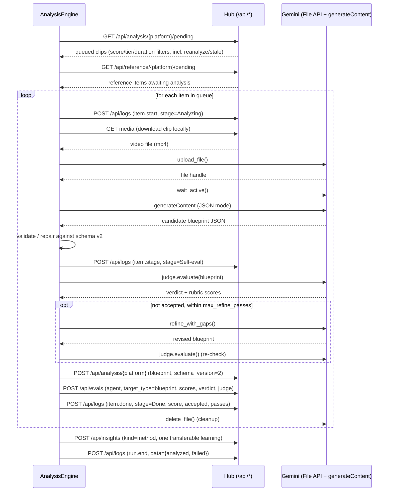

# Agent: AnalysisEngine

AnalysisEngine is the pipeline's **analyzer**. It watches the top-viral clips that the `media` stage has downloaded, walks them frame-by-frame with Gemini, and writes back a rich, generation-ready **blueprint** — the shared substrate that every producer (SimilarContent, and future proposal/idea/template agents) reads before it writes anything.

It occupies the **Blueprint** stage of the [7-stage pipeline](architecture.md) (labeled "Blueprint" on the board, not "Analyze," to avoid collision with the scoring stage that already runs inside ReelScraper).

!!! note "Integration boundary"
    AnalysisEngine never touches another agent's files. It talks to the hub exclusively over `/api/*` (`BACKEND_API`, default `http://127.0.0.1:8787`), and it talks to Google exclusively through the Gemini File API. See [Architecture](architecture.md) for the one-integration-point principle.

## What it produces

For every clip it analyzes, AnalysisEngine posts one **schema_version 2 blueprint** to `POST /api/analysis/{platform}`. This is the richest artifact in the system — the difference between a lean v1 record ("here's a summary and a hook") and a v2 blueprint ("here's everything a generation pipeline needs to recreate this clip shot-by-shot").

At a high level, a v2 blueprint carries:

| Field | What it holds |
|---|---|
| `video_metadata` | Duration, resolution, platform, source identifiers |
| `global_style` | Overall visual/tonal treatment applied across the clip |
| `audio` | The soundtrack/voiceover actually used in the source clip |
| `audio_strategy` | Whether the audio is reusable as-is, needs a substitute, or must be regenerated — the signal producers branch on |
| `characters_and_subjects[]` | Recurring on-screen subjects, for continuity across shots |
| `text_overlays[]` | On-screen text/captions with timing |
| `shots[]` | Per-shot breakdown, each with a `generation_prompt` / `negative_prompt` pair usable directly by an image/video generator |
| `regeneration_guide` | Assembly instructions for recreating the clip from the shots |
| `virality_formula` | The narrative explanation of *why* this clip worked, reused verbatim by corpus briefs and producers |
| `evaluation` | The self-eval judge's verdict and rubric scores for this blueprint |

!!! tip "Full schema"
    This page covers the shape at a glance. For the authoritative field-by-field reference, see [Concepts → Blueprint schema](concepts.md).

Reference videos (`is_reference:true`, ingested via `POST /api/reference/{platform}`) flow through the exact same analysis path and are saved under a synthetic `ref_<hash>` id — they exist for the template-content producer and are never scored as corpus content.

## Bootstrap

On startup, AnalysisEngine runs the same three-step bootstrap shared by every agent in the fleet:

1. `GET /api/platforms` — confirm the hub is reachable; exits non-zero if not.
2. `POST /api/producers/register` — idempotent upsert of its manifest: `kind:"analyzer"`, `workflow_stages: ["Queued","Analyzing","Self-eval","Done"]`. This is what makes it appear as a lane on the Dashboard's agent board.
3. `GET /api/config/agent/analysis-engine` — pull hub-stored config (thresholds, refine-pass cap, model names) and merge it over local defaults.

## The per-clip flow

For each queue item, AnalysisEngine runs: pull the pending item → download its media → upload to Gemini's File API → `generateContent` → validate/repair the JSON against the blueprint schema → self-eval judge pass → refine loop (bounded) → publish the blueprint, eval, and logs.

## Stage-by-stage notes

**Pull pending.** The queue comes from `GET /api/analysis/{platform}/pending`, filterable by `min_score`, `tier`, `min_duration`, `max_duration`, `content_type`, and `limit`; it also accepts `reanalyze=<content_id>` and `stale=true` to force re-analysis of a specific or aging item. Reference items (`GET /api/reference/{platform}/pending`) are appended to the same run unless `--no-references` is passed.

**Download media.** The clip is fetched from the hub's `/media` static mount (or, if unavailable, via a yt-dlp fallback) into a local temp file before it is handed to Gemini.

**Gemini File API upload + `generateContent`.** The clip is uploaded via Gemini's File API, polled until active, then analyzed with a JSON-mode `generateContent` call using a system prompt composed locally from platform memory.

**Validate / repair.** The raw model output is checked against the blueprint schema locally (`engine/schema.py`); malformed or incomplete JSON is repaired before it ever reaches the judge.

**Self-eval judge + refine loop.** A second Gemini client, configured as judge, scores the blueprint against a rubric and runs hard-fail checks. If not accepted, AnalysisEngine calls `refine_with_gaps()` to patch specific gaps and re-judges — bounded by `max_refine_passes` from agent config, so a stubborn blueprint fails out rather than looping forever.

**Publish.** Once accepted (or the refine cap is hit), the blueprint is posted to `POST /api/analysis/{platform}`, the judge's verdict is posted to `POST /api/evals`, and lifecycle events go to `POST /api/logs`. After the whole run, one transferable learning is posted to `POST /api/insights` for other agents to read.

!!! warning "Failure handling"
    A tripped circuit breaker (`CircuitTripped`) ends the run early with `run.error`. A per-item `GeminiError` or `HubError` is logged as `item.error` (stage=Failed, an implicit terminal lane on the agent board) and the breaker records the failure — the run continues to the next item.

## Other entry points

| Command | Behavior |
|---|---|
| `run <platform>` | The full queue loop described above. |
| `once <content_id>` | Same bootstrap, then searches pending/reference queues across platforms for one matching `content_id` and analyzes just that item, wrapped in its own `run.start`/`run.end` pair. |
| `status` | Bootstrap only, then prints `GET /api/platforms`, `GET /api/config/agent/analysis-engine/secrets/status`, and the merged boot config — no analysis performed. |

## Where this fits

AnalysisEngine's output is read by every downstream producer (see [SimilarContent](agents-producers.md)) via `GET /api/analysis/{platform}` and `GET /api/analysis/{platform}/{content_id}`, and by the corpus brief endpoint (`GET /api/corpus/{platform}/brief`) which pulls `virality_formula` straight out of the blueprint. See [API Reference](api-reference.md) for the full request/response shapes, and [Architecture](architecture.md) for how the Blueprint stage sits between Media and Studio.
