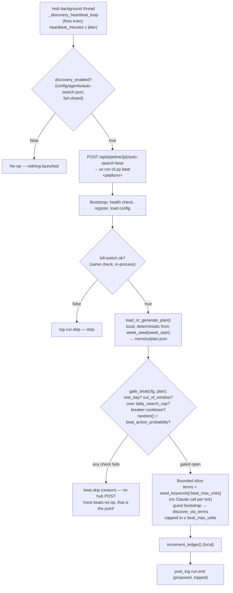

# Agent: AutoSearch (discovery)

AutoSearch is the pipeline's front door. It is the only agent — besides the hub's own scraper — permitted to touch Instagram, and it does so read-only, guest-first, and on a leash: paced strictly slower than the scraper, opt-in for any authenticated ("burner") session, and gated by a kill-switch that fails closed. Its job is narrow: find creators worth adding to the corpus, score them for niche-fit, and hand a **candidate** to a human. It never writes to `pages.txt` directly and never bypasses the human gate.

```
Discover (AutoSearch) → Sources (pages.txt) → Scrape → Analyze → Media → Blueprint → Studio
```

AutoSearch owns only the first stage. Everything downstream — actually scraping the approved handle, scoring its content, generating from it — belongs to other agents described in [Architecture](architecture.md) and the [Pipeline](architecture.md) overview.

!!! note "Kind: `discovery`"
    AutoSearch registers with the hub's producer registry (`POST /api/producers/register`) as `kind: "discovery"`, `human_gate: true`, `output_status: "pending"`, with workflow lanes `Queued → Searching → Scoring → Proposed → Approved/Rejected`. See [Agent Registry & SPI](agents-producers.md) for the manifest shape shared by every agent.

## What it produces

AutoSearch never touches `pages.txt`. It posts **candidates** — one per discovered creator — to the hub, and a human decides what happens next.

| Concept | Description |
|---|---|
| `candidate_id` | Stable join key: agent-supplied, or a deterministic `cand_<sha1(platform:handle)>[:10]` hash. Upserts, never dupes. |
| `discovery/{platform}/candidates.json` | Persisted candidate records for the platform. |
| `discovery/{platform}/gate.jsonl` | Append-only human-gate decision log (approve/reject), parallel to `studio/{p}/gate.jsonl`. |
| Status lifecycle | Hub forces `status: "pending"` on first insert. A later re-ingest of the same handle never silently un-gates an already-approved or already-rejected candidate. |

On approval, the hub — not the agent — calls a safe, comment-preserving, deduped `_append_handle_to_pages()` against the platform's `pages.txt`. This is an append, never the whole-file overwrite that `PUT /api/config/{platform}` performs.

## Diagram 1 — discovery sequence

The full flow from a manual/exhaustive `cli.py run` invocation: bootstrap, term expansion, guest/burner search, scoring, candidate submission, and the human gate that eventually appends a handle to `pages.txt`.

```mermaid
sequenceDiagram
    participant AS as AutoSearch
    participant Hub as Hub (/api/*)
    participant Claude as Claude (Anthropic API)
    participant IG as Instagram (guest/burner)
    participant Human as Human (Dashboard)

    AS->>Hub: GET /api/platforms (health check)
    AS->>Hub: POST /api/producers/register (kind: discovery)
    AS->>Hub: GET /api/config/agent/auto-search
    Note over AS: merge config over DEFAULTS<br/>(discovery_enabled kill-switch, cadence knobs)

    AS->>Hub: GET /api/config/{platform} (niche_config.json + pages.txt)
    AS->>Hub: GET /api/corpus/{platform}/factors
    AS->>Hub: GET /api/insights (prior "trending-terms" insight)

    AS->>Claude: expand_terms(niche, seed_keywords, factors, trending_insight)
    Claude-->>AS: expanded search terms

    AS->>IG: GuestSession().bootstrap() (cookie/csrf)
    opt guest_only = false
        AS->>IG: load burner session (opt-in only)
    end

    loop per expanded term
        AS->>IG: topsearch() (burner-only; guest-only skips with a banner)
        IG-->>AS: candidate usernames
        loop per new username
            AS->>IG: web_profile_info() (hydrate)
            AS->>IG: sample_reels() (median_plays)
            AS->>AS: passes_gates() heuristic score
            AS->>Hub: POST /api/logs item.start (stage: Queued)
            AS->>Hub: POST /api/logs item.stage (stage: Searching)
            AS->>Hub: POST /api/logs item.stage (stage: Scoring)
            AS->>Hub: POST /api/discovery/{platform} (CandidateIn incl. relevance.score)
            Hub-->>AS: candidate upserted, status forced to "pending"
            AS->>Hub: POST /api/logs item.done (stage: Proposed, score)
        end
    end

    AS->>Hub: POST /api/insights (tags: trending-terms, auto-search, platform)
    AS->>Hub: POST /api/logs run.end (proposed count)

    Human->>Hub: GET /api/discovery/{platform}/pending
    Human->>Hub: POST /api/discovery/{platform}/{candidate_id}/status (approved)
    Hub->>Hub: _append_handle_to_pages() (append-only, deduped)
    Hub->>Hub: append discovery/{p}/gate.jsonl (incl. appended_to_pages)
    Note over Hub: next scrape run ingests the new handle
```

Every per-candidate event follows the same lifecycle vocabulary shared across all agents: `item.start → item.stage → item.done` (or `item.error` → the implicit **Failed** lane). `Approved`/`Rejected` are never emitted by AutoSearch itself — the hub's `GET /api/agents/auto-search/board` reducer derives them by left-joining `discovery/{p}/gate.jsonl`, keyed on `content_id == candidate_id` (the discovery-kind board join, distinct from studio's filename join). See [Observability & Logging](concepts.md) for the full event contract.

## Diagram 2 — weekly budget → daily plan → heartbeat cadence

AutoSearch's manual `cli.py run` (above) is exhaustive and bypasses the weekly plan, but the cadence is what governs *unattended* operation: a weekly search budget is spread across randomized daily allotments (with built-in rest days), and a thin heartbeat trickle checks in during organic hours. Most beats do nothing — that is the design.



| Cadence concept | Where it lives | Notes |
|---|---|---|
| Weekly budget → daily allotments | `memory/plan.json`, regenerated deterministically from `week_seed(week_start)` | Purely local computation — not a hub call. Includes rest days. |
| Heartbeat delivery | Hub's `_discovery_heartbeat_loop` (app.py) | Reads `config/agents/auto-search.json` directly, fail-closed, every `heartbeat_minutes` ± jitter. Only fires `auto-search-beat` if `discovery_enabled`. |
| Beat gate | `planlib.gate_beat()` | Pure local function: rest day → out-of-window → over cap → breaker cooldown → probability roll. Any failure is a silent no-op (no hub POST for the skip). |
| Bounded slice | `discover_via_terms(..., max_units=beat_max_units)` | Seed keywords only (no per-tick Claude call), capped to `beat_max_units` work units. |
| Alternative delivery | OS cron, a `schedule` cloud routine, or a manual `cli.py run` | The heartbeat thread is the default, not the only, trigger path. |

## The safety contract

!!! danger "Non-negotiable — enforced in code, not policy"
    AutoSearch is the only discovery agent with Instagram access, and every design decision here exists to keep that access narrow, observable, and reversible. None of the following are configurable away by an operator without editing the agent itself:

    - **Guest-first.** Every run bootstraps a guest session (cookie/csrf, no login). Authenticated ("burner") access is strictly opt-in (`guest_only=false`) and only used for `topsearch()` — guest-only mode skips search terms with a banner rather than escalating silently.
    - **Burner-only for search.** `topsearch()` is gated to burner sessions; there is no guest fallback path that performs it anyway.
    - **Pacing floors.** AutoSearch's request cadence is strictly slower than the scraper's own guest pacing — it is a *secondary* citizen on Instagram, not a competing one.
    - **3-strike circuit breaker.** A `CircuitBreaker` trips the run after repeated failures (mirroring the scraper's own breaker), converting sustained errors into a hard stop instead of a retry storm.
    - **Caps.** `daily_search_cap` and `beat_max_units` bound both the manual run and every heartbeat beat — no unbounded crawling.
    - **Kill-switch, fail-closed.** `discovery_enabled` defaults to `false`. Both the hub's heartbeat loop and the agent's own `cmd_run`/`cmd_beat` check it directly from `config/agents/auto-search.json` before doing anything — absence or a read failure means *off*.
    - **Purge-on-reject.** A rejected candidate is a terminal, human-authored decision recorded in `discovery/{p}/gate.jsonl`; re-ingesting the same handle later never silently reopens or re-proposes it.
    - **Human gate before `pages.txt`.** AutoSearch never appends to `pages.txt`. Only a human's `POST /api/discovery/{p}/{candidate_id}/status {status:"approved"}` triggers the hub's own deduped, comment-preserving append.

    Full rationale and enforcement detail live in the [Safety & Guardrails spec](agents-autosearch.md).

## Claude's two roles

Unlike the analysis and studio agents, AutoSearch calls Claude directly (not via the hub) for two narrow, text-only tasks:

1. **Term expansion.** Given the niche config, seed keywords, corpus factors, and the prior "trending-terms" insight, Claude expands a short seed-keyword list into a richer set of search terms. This only happens on a manual/exhaustive `cli.py run` — heartbeat beats reuse seed keywords verbatim to stay cheap.
2. **Relevance scoring.** Alongside a heuristic gate (`passes_gates()` on followers/median_plays/etc.), Claude judges niche-fit for each hydrated candidate, producing the `relevance: {score, reasons[]}` object attached to the candidate payload.

If `ANTHROPIC_API_KEY` is absent, term expansion falls back to seed keywords verbatim — AutoSearch degrades gracefully rather than failing the run.

## Reference

**Manifest** (registered at every `Bootstrap.start()`):

```json
{
  "name": "auto-search",
  "kind": "discovery",
  "human_gate": true,
  "output_status": "pending",
  "workflow_stages": ["Queued", "Searching", "Scoring", "Proposed", "Approved", "Rejected"]
}
```

**Key hub endpoints AutoSearch calls:**

| Endpoint | Purpose |
|---|---|
| `GET /api/platforms` | Health check at boot. |
| `POST /api/producers/register` | Idempotent manifest upsert. |
| `GET /api/config/agent/auto-search` | Fetch agent config incl. `discovery_enabled`, cadence knobs. |
| `GET /api/config/{platform}` | Read niche config + `pages.txt`. |
| `GET /api/corpus/{platform}/factors` | Ground term expansion in what already works. |
| `GET /api/insights` | Read prior trending-terms insight. |
| `POST /api/discovery/{platform}` | Ingest/upsert one candidate (`CandidateIn`). |
| `POST /api/logs` | Lifecycle events (`item.start`/`item.stage`/`item.done`/`item.error`, `run.start`/`run.end`/`run.skip`). |
| `POST /api/insights` | Post one transferable learning (trending-terms) per run. |

**Human-gate-only endpoints (Dashboard → hub, not AutoSearch):**

| Endpoint | Purpose |
|---|---|
| `GET /api/discovery/{platform}?status=` | Candidate rows, newest-first, with derived `in_pages` flag. |
| `GET /api/discovery/{platform}/pending` | The review queue. |
| `POST /api/discovery/{platform}/{candidate_id}/status` | Approve/reject; on approve, appends to `pages.txt` and `discovery/{p}/gate.jsonl`. |

!!! tip "Verification without touching Instagram"
    `cli.py smoke` asserts the guest cookie jar carries no `sessionid` and performs one `web_profile_info` hydration — no hub writes besides logs. `cli.py synthetic` fabricates N candidates locally (no IG/Anthropic calls) and drives the identical `item.start → Searching → Scoring → post_candidate → item.done` sequence, useful for testing the Dashboard's discovery lane end-to-end.

## See also

- [Safety & Guardrails](agents-autosearch.md) — the full non-negotiable contract this page summarizes.
- [Architecture](architecture.md) — how AutoSearch fits alongside the hub and other agents.
- [Pipeline](architecture.md) — the 7-stage Discover → Studio flow.
- [Agent Registry & SPI](agents-producers.md) — the shared manifest/config/secrets contract every agent implements.
- [Observability & Logging](concepts.md) — the `item.*`/`run.*` event vocabulary and board reducer.
