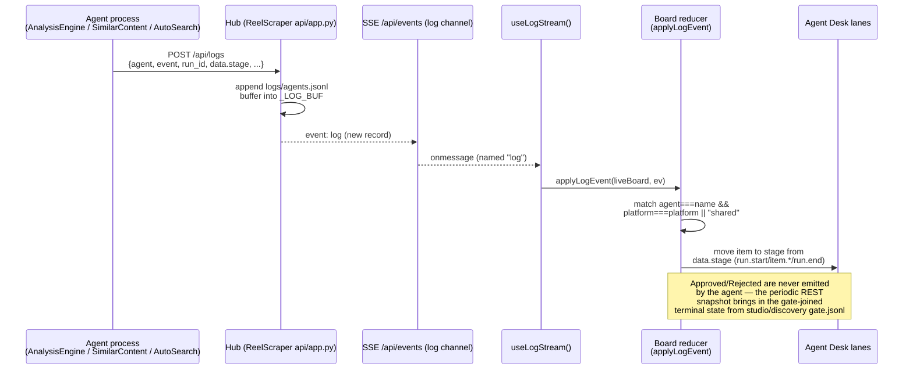
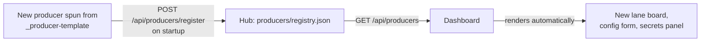

# Agent: Dashboard

**"The Cutting Room"** is the control board for the pipeline: a React 18 + TypeScript + Vite single-page app, styled with Tailwind v4 and animated with Framer Motion, that reads and drives every stage of the pipeline over HTTP. It renders producer lanes, the human gate, sounds, blueprints, activity, and discovery — and it never touches another agent's files. Every fact on screen comes from `/api/*` on the [hub](architecture.md).

!!! note "Nothing here is agent-specific"
    The Dashboard has no hardcoded knowledge of SimilarContent, AnalysisEngine, or AutoSearch. It renders whatever the [producer registry](agents-producers.md) reports. This is the whole point of the design — see [Registry-driven pluggability](#registry-driven-pluggability).

## Stack

| Layer | Choice | Role |
|---|---|---|
| Build | Vite | dev server proxying `/api`, `/media` and `/renders`; production build emits static assets |
| Language | TypeScript | typed API client and hooks |
| Styling | Tailwind v4 | utility-first styling, the "measuring tape" visual system |
| Data | TanStack Query | REST resource caching, invalidation, background refetch |
| Lists | TanStack Virtual | virtualized rendering for long corpus/log lists |
| Motion | Framer Motion | lane transitions, packet-flow animation on the data-flow view |
| Charts | Recharts | score-trend charts fed by `GET /api/evals` |

## Deployment: same-origin with the hub

In production the Dashboard is not a separate service. Its build output is mounted directly by the hub's static-file server, so the browser talks to one origin:

```
BASE = ""   # production: same-origin as the hub
```

In development, Vite proxies three paths to the running hub so the app can be edited with hot reload while still hitting real data:

- `/api` → the hub's REST + SSE surface
- `/media` → the **scraped corpus**: range-request video/thumbnail mount
- `/renders` → **producer-generated** reels, in their own namespace; this is what lets the Studio's Renders tab play them inline

### The proxy target is resolved, not hardcoded

The hub does not always own 8787 — `cli.py start` falls back to a free port when it is busy, printing the real one as `HUB_URL=…`. So `vite.config.ts` reads the target from the environment:

```ts
const env = loadEnv(mode, ".", "");            // empty prefix → unprefixed vars
const HUB = env.BACKEND_API || "http://127.0.0.1:8787";
```

```bash
BACKEND_API=http://127.0.0.1:9123 npm run dev  # just works
```

`loadEnv` rather than `process.env` because it is Vite's own API and needs no `@types/node`; the empty prefix is what opts in to unprefixed variables like `BACKEND_API`. This is the same variable every sibling agent uses to find the hub, so one value configures the whole system.

Dev is the **only** place the hub's address is needed. Production is same-origin and therefore port-agnostic by construction.

The deploy target directory is parameterized, not hardcoded:

```
BACKEND_DIR (default: ../ReelScraper)  →  build output copied to
$BACKEND_DIR/frontend/dist
```

The hub's static mount at `/` serves `frontend/dist` when present, falling back to a plain "hub is running, frontend not built" page otherwise. See [Architecture: static mounts](architecture.md) for the mount details.

!!! tip "Why same-origin matters"
    No CORS configuration, no separate auth story, no second deployment to keep in sync with the hub's contract. The Dashboard is a client of the hub's OpenAPI-documented contract (`/docs`), nothing more.

## The views

The board is organized around the pipeline's stages and the hub's resource groups, not around any one agent:

| View | Backed by | Purpose |
|---|---|---|
| Board | `POST /api/pipeline/{platform}/{stage}`, `.../run-all`, `GET /api/pipeline/status`, `GET /api/platforms` | the live pipeline tape — launch stage jobs and watch them flow node-to-node (see [The Board](#the-board)) |
| Corpus | `GET /api/corpus/{platform}/*`, `GET /api/content/{platform}`, `GET /api/analysis/{platform}[/{content_id}]` | factors, top-N viral clips, the scored content board, and schema_version-2 blueprint breakdowns |
| Sounds | `GET /api/audio/{platform}/trending`, `.../sound/{audio_id}` | trending-sound table and per-sound detail |
| Studio + Gate | `GET/POST /api/studio/{platform}`, `POST /api/studio/{platform}/{file}/status`, `DELETE /api/studio/{platform}/{file}`, `POST /api/studio/{platform}/{file}/render`, `GET /api/renders/{platform}` | producer proposals, the human approve/reject gate, removing a rejected card, and the rendered reels (see [The Studio](#the-studio-proposals-renders)) |
| Producers | `GET /api/producers`, `GET /api/reference/{platform}` | registered producers & analyzers on the floor, plus reference clips |
| Discovery | `GET /api/discovery/{platform}[/pending]`, `POST /api/discovery/{platform}/{candidate_id}/status` | AutoSearch candidates and the human gate that appends to `pages.txt` |
| Agent Desk | `GET /api/agents/{name}/board` | per-agent live workflow lanes (this page's focus) |
| Activity | `GET /api/events` (`log` channel), `GET /api/logs` | the Floor Log — lifecycle events grouped into per-run threads across every agent |
| Evals | `GET /api/evals` | score-trend charts (Recharts) per agent/target type |
| Playbook | `GET/POST /api/insights`, `GET /api/corpus/{platform}/factors` | the winning formula, the ranked lift field, and the shared cross-agent memory exchange |
| Config | `GET/PUT /api/config/{platform}`, `GET/PUT /api/schedule[/{platform}]` | the Bench — niche weights, keywords, `pages.txt`, and automatic runs |

See [Pipeline](architecture.md) for how these views map onto the eight pipeline stages, and [API Reference](api-reference.md) for the full route contract.

## The Board

Each card reports **its own stage**, not the end of the pipeline. That distinction is the
whole point: `watchlist` moves when you add a handle, `scraped_items` when the scrape
finishes, `items`/`viral` only after `analyze`. Reading them all off the scored corpus — as
the board once did — meant a freshly added handle showed "0 pages" and 250 scraped reels
showed "0 reels" until two more stages had run, so a working pipeline was indistinguishable
from a broken one.

| Card | Count | Action |
|---|---|---|
| Discover | pending candidates | Run `auto-search` |
| **Sources** | `watchlist` | **Add pages** → the watchlist in Config |
| Scrape | `scraped_items` | Run, or the reason it cannot |
| Analyze | `items` scored · `viral` | ” |
| Media | `media_ready` | ” |
| Blueprint | `analyzed` | ” |
| Studio | proposals | Open board |

Sources is not a runnable stage — its input is a human adding handles — so instead of a Run
button it carries the one link that changes its number. Every other empty state in the app
routes to the same place, and stops offering it once handles exist.

A stage whose input is missing is greyed out, states why, and offers the stage that would
unblock it (`readiness.blocked_by`); following that chain terminates at something only a
human can do. **Run full pipeline** stays disabled while any stage is running, rather than
re-enabling the moment the POST returns.

Failures surface in the header status, which carries the failing stage's last output line
and opens the Floor Log. Refused requests raise a toast carrying the hub's own sentence —
before this, every mutation swallowed its error and a rejected click looked like nothing at
all had happened.

## The Studio: Proposals | Renders

`StudioView` is split into two tabs by a segmented control, because the two halves answer different questions.

| Tab | Shows | The question it answers |
|---|---|---|
| **Proposals** | Every studio item, filterable by gate status | "What has the producer written, and what do I approve?" |
| **Renders** | One swatch per **approved** item, with its render if one exists | "What is actually ready to post?" |

### The Renders tab

A grid of compact swatches (`RenderSwatch.tsx`) in the **Corpus card's visual language** — the same vocabulary the corpus grid uses, so a generated reel reads as a sibling of a scraped one. Each swatch is one approved studio item; clicking its media opens `RenderModal.tsx`.

The row model comes from `lib/renderJoin.ts`: `joinRenders(approved, indexRenders(renders))` left-joins render records onto approved proposals on `file`, the exact join key. So an approved item with no render yet still gets a swatch — with a **Render** button on it — rather than being invisible until someone renders it.

`RenderModal` has three tabs, and together they are everything needed to post the reel to Instagram by hand:

| Tab | Contents |
|---|---|
| **Post kit** | The video, the caption, the hashtags, and the on-disk path to hand to the upload dialog |
| **Sound** | The `## Audio` block — which sound to attach, and why (the pipeline never muxes licensed audio) |
| **Script** | The full proposal markdown |

!!! note "Not virtualized, deliberately"
    Unlike the Corpus grid, the Renders grid mounts every row. The counts are single-digit, and `VirtualReelGrid`'s row math assumes the Corpus 3:4 card, not a 9:16 tower.

### Live render state

Rendering is launched with `POST /api/studio/{p}/{file}/render` and watched through the existing SSE job snapshot — no new channel. The hub gives a render job a **deterministic** id, `${platform}:render:${file}`, so the swatch resolves its own job with a single map read rather than scanning the job list:

```ts
job={jobs[`${platform}:render:${proposal.file}`]}
```

That same determinism is what stops a double-click from starting a second paid render — the hub treats the key as a per-item lock. `useRenders` (in `lib/hooks.ts`) refetches on window focus and is invalidated by `useInvalidateOnJobDone` when a `render` job settles, so the finished reel appears without a manual reload.

Renders play inline from the `/renders` mount, which is range-request capable. `?v=<updated_at ms>` on the URL is what makes a re-render actually show the new video instead of the browser's cached copy.

## Live-data strategy

The Dashboard uses exactly one persistent connection — `EventSource("/api/events")` — fanned out to two different concerns, plus ordinary TanStack Query polling/refetch for everything else.

### Channel 1: unnamed frames → job status

Default (unnamed) SSE frames carry a snapshot of the hub's in-memory `JOBS` map roughly once a second. `usePipelineEvents()` parses each frame into job state for the Pipeline view's progress indicators. If the connection drops, the hook falls back to polling `GET /api/pipeline/status` every 2 seconds and retries the SSE connection every 4 seconds.

### Channel 2: the `log` channel → Activity + Agent Desk

Named `event: log` frames carry newly appended lifecycle events — the same curated stream every agent writes via `POST /api/logs`. Two consumers read it:

- **Activity view** — `useLogStream(max=200)` seeds from `GET /api/logs` on mount, then appends each live `log` frame into a bounded ring buffer.
- **Agent Desk board** — `useAgentBoard(name, platform)` folds live `log` events on top of a periodic `GET /api/agents/{name}/board` snapshot, so lanes move between fetches without re-querying the server on every event.



!!! warning "The client-side reducer is a mirror, not the source of truth"
    `applyLogEvent` on the client approximates the same reduction the hub performs server-side over `logs/agents.jsonl` for `GET /api/agents/{name}/board`. It exists purely so lanes feel live between polls. The periodic REST refetch is what reconciles state — including gate decisions (`Approved`/`Rejected`) that no agent ever posts directly, since those are always derived by the hub left-joining `studio/{platform}/gate.jsonl` (by filename) or `discovery/{platform}/gate.jsonl` (by `content_id == candidate_id`).

### Everything else: TanStack Query

Non-streaming resources — content, config, corpus, studio, insights, producers, trending, analysis, blueprints, evals, logs, references, candidates, agent config, secrets status — are plain TanStack Query hooks with normal cache keys, background refetch on window focus, and a modest staleTime (20s unless a view has a reason to poll faster, e.g. `usePlatforms` at 15s).

`useInvalidateOnJobDone(jobs, platform)` watches the job-status stream for a job transitioning to `done`/`error` and invalidates only the query keys that stage actually affects:

| Stage that finished | Queries invalidated |
|---|---|
| `scrape`, `media` | content, trending |
| `analyze`, `analysis-engine` | analysis, content, evals, references |
| `auto-search`, `auto-search-beat` | candidates, config |

## The Agent Desk board

Every agent gets a board: `GET /api/agents/{name}/board?platform=&limit_runs=10`. The hub reduces that agent's slice of `logs/agents.jsonl` into `runs → items → current stage`, then left-joins gate status from `studio/{platform}/gate.jsonl` (producers, keyed by filename) or `discovery/{platform}/gate.jsonl` (discovery-kind agents, keyed by `content_id == candidate_id`).

Lane labels are not hardcoded in the Dashboard — they come from `workflow_stages[]` in the agent's registered manifest:

| Agent kind | Example `workflow_stages` |
|---|---|
| `analyzer` (AnalysisEngine) | Queued, Analyzing, Self-eval, Done |
| producer (SimilarContent) | Queued, Generating, Self-eval, Proposed, Approved, Rejected |
| `discovery` (AutoSearch) | Queued, Searching, Scoring, Proposed, Approved, Rejected |

`Failed` is an implicit terminal lane, shown only when an item actually lands there via an `item.error` event — it is not a declared workflow stage.

Items move through lanes strictly by event type and `data.stage`:

```
run.start → item.start(data.stage = first workflow_stage)
          → item.stage(data.stage = mid-lane transition)
          → item.done(data.stage = terminal lane, + data.score / data.file for producers)
→ run.end
```

`item.error` moves an item to the implicit `Failed` lane regardless of what stage it was in. `run_id` groups the items belonging to one invocation and also links back to the agent's own full-fidelity local JSONL log, for deeper debugging outside the Dashboard.

## Registry-driven pluggability

The producer registry is the mechanism that lets a brand-new agent appear on the board with **zero UI code**:

1. On startup, every agent calls `POST /api/producers/register` with its manifest — `name`, `kind`, `consumes[]`, `human_gate`, `needs_reference`, `produces`, `output_status`, `config_schema`, `secrets[]`, `workflow_stages[]`. The call is an idempotent upsert by `name`, persisted to `producers/registry.json`.
2. The Dashboard calls `GET /api/producers` to get the full roster and renders one lane-board per registered producer.
3. Each board's lane labels, config form fields, and secret-presence indicators are all driven by that manifest — not by a switch statement in the frontend.



Because the manifest also carries `config_schema` (for `GET/PUT /api/config/agent/{agent}`, a schema-driven settings form) and `secrets[]` (resolved against `GET /api/config/agent/{agent}/secrets/status`, which reports presence only — never values), a new producer gets a working settings panel and secrets indicator for free, with no Dashboard code change. This is the practical meaning of "the hub is the single integration point": the frontend integrates with the *registry*, not with any individual agent.

!!! note "Keys & models reads the roster, not the registry"
    Registration is lazy — an agent registers when its CLI first runs — so on a clean clone the registry is empty. The **Keys & models** panel therefore reads [`GET /api/agents`](api-reference.md#producers), which always carries the built-in agents with their key status computed live, and marks the ones that have never run as *not started yet*. Without it the panel was empty on a fresh install and could say nothing about the key that gates the Blueprint stage — the one thing a first-run user most needs to know.

    The **Discover** tab's cadence panel uses the same roster to decide whether to offer the term-expansion opt-in, since that switch only makes sense once a key is actually resolvable.

!!! tip "Spinning up a new producer"
    The [`_producer-template`](agents-producers.md) scaffold exists precisely so a new producer inherits this for free — copy the template, fill in `agent.json`, and its first successful `POST /api/producers/register` is the only step required before it shows up in the Dashboard.

## The measuring-tape / seam signature motif

The Dashboard's visual identity leans into its subject matter — a cutting room for video — using a recurring **measuring-tape and seam** motif: tick-marked rulers along scrubbers and timeline-adjacent UI, and stitched "seam" dividers marking the boundaries between panes (echoing where footage is spliced). This is a styling convention carried through Tailwind utility classes and Framer Motion transitions rather than a separate component library, keeping the same lightweight, same-origin deployment model as the rest of the app.

## Related pages

- [Architecture](architecture.md) — the hub as the single integration point, static mounts, storage layout
- [Pipeline](architecture.md) — the eight-stage pipeline the Dashboard's views are organized around
- [API Reference](api-reference.md) — full `/api/*` route contract, including `/api/events` and `/api/agents/{name}/board`
- [Agents: Producers](agents-producers.md) — the producer SPI and `_producer-template`
- [Agents: Registry](agents-producers.md) — the producer registry contract in depth
