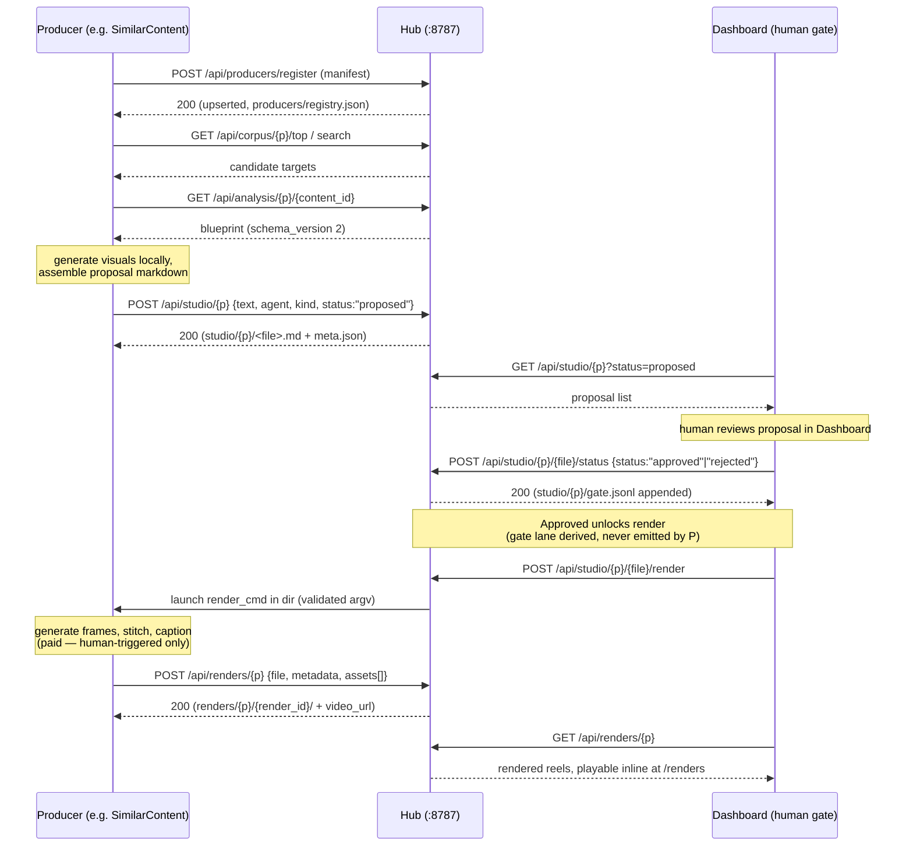

# Producers & the Producer SPI

Producers are the agents that turn a blueprint into a posting proposal — and, if they declare a render surface, into the finished media. Today there is one: **SimilarContent**, a `kind:clone` agent that recreates a winning clip 1:1 and renders approved recipes into actual reels. Three more are planned from the same scaffold. This page documents the SPI (service provider interface) every producer must implement, walks through SimilarContent's full call sequence, and shows how to build a new producer with the copy-scaffold recipe.

!!! note "Prerequisite reading"
    This page assumes familiarity with the hub's REST contract ([API Reference](api-reference.md)) and the 7-stage pipeline ([Architecture](architecture.md)). The blueprint schema that producers consume is documented in [Agents: AnalysisEngine](agents-analysisengine.md).

## What a producer is

A producer reads the shared corpus, blueprints, audio trends, and cross-agent insights, and writes a **studio proposal** — a markdown file describing exactly what to generate (or re-generate) for a platform. It never posts to the platform itself and never touches another agent's files. Every read and write goes through the hub's `/api/*` surface.

```
consumes: corpus, analysis (blueprints), audio, insights
produces: studio_markdown  →  POST /api/studio/{platform}
gate:     human approve/reject in the Dashboard
render:   (optional) approved item → media → POST /api/renders/{platform}
```

The proposal half is free — it reads blueprints and writes markdown. The render half costs money per frame, so it is a **separate, human-triggered invocation**, never part of a pipeline run.

| Producer | `kind` | `human_gate` | `needs_reference` | Status |
|---|---|---|---|---|
| SimilarContent | `clone` | `false` | `false` | Live |
| proposal-content | `proposal` | `true` | `false` | Planned |
| creative-idea | `idea` | — | `false` | Planned |
| template-content | `template` | — | `true` | Planned |

!!! note "Human gate is universal, `human_gate` in the manifest is not"
    Every studio proposal is gated by a human approve/reject step in the Dashboard regardless of the manifest flag — that gate lives in the `studio/{p}/gate.jsonl` workflow, not in the producer. The manifest's `human_gate` field is closer to a declared intent/UX hint (e.g. proposal-content flags it explicitly because it's producing candidate scripts meant for human selection); it doesn't change the mechanics described below.

## The Producer SPI

Every generation agent — SimilarContent today, proposal/idea/template producers tomorrow — implements the same contract with the hub: four mandatory parts, plus an optional fifth for producers that render.

### 1. Register

On startup, a producer self-registers its manifest. Registration is an idempotent upsert keyed by `name`, so restarting an agent, or redeploying it, never creates duplicate roster entries.

```
POST /api/producers/register
```

```json title="ProducerManifest"
{
  "name": "similar-content",
  "kind": "clone",
  "consumes": ["corpus", "analysis", "audio", "insights"],
  "human_gate": false,
  "needs_reference": false,
  "produces": "studio_markdown",
  "output_status": "proposed",

  "renderable": true,
  "dir": "SimilarContent",
  "render_cmd": ["uv", "run", "cli.py", "render"],

  "config_schema": { "...": "..." },
  "secrets": [{ "name": "...", "env_var": "...", "required": true }],
  "workflow_stages": ["Queued", "Generating", "Self-eval", "Proposed", "Approved",
                      "Rendering", "Rendered", "Rejected"]
}
```

### Declaring a render surface

The three fields in the middle are what make a producer **renderable** — able to turn an approved proposal into an actual media file. They are optional; a producer that only writes markdown omits all three.

| Field | Meaning |
|---|---|
| `renderable` | `true` opts this producer into `POST /api/studio/{p}/{file}/render`. |
| `dir` | The producer's own directory name. Must be a **direct sibling** of the hub repo — no slashes, no leading dot. This is the working directory the command runs in. |
| `render_cmd` | The argv the hub executes there. Must start with an allowlisted launcher (`uv`, `python`, `python3`, `node`, `npm`), and every argument must match `^[A-Za-z0-9._/=:-]{1,120}$` with no absolute path and no `..`. |

The hub hardcodes no producer name or path: it resolves the producer from the studio item's `agent` field, then reads these fields from that agent's registered manifest. Adding a second renderable producer needs no hub change.

!!! warning "`render_cmd` is validated, not trusted"
    `POST /api/producers/register` is unauthenticated and `ProducerManifest` allows extra fields, so `render_cmd` is caller-supplied and ends up as argv for `subprocess.run`. The launcher allowlist and argument shape-check are the actual security boundary, not defence in depth — `dir` only pins the working directory, never the command. `shell=True` is never used. See `SECURITY.md` at the repo root.

The registry is what makes new producers appear on the Dashboard automatically — `GET /api/producers` drives the producer lanes shown on the board, so shipping a new producer is purely additive: register it, and the UI grows a lane with no frontend change.

```
GET /api/producers            # full roster
GET /api/producers/{name}     # one manifest
```

`workflow_stages` is the ordered lane list the agent board renders for this producer (see [Agents: AutoSearch](agents-autosearch.md) for the parallel discovery-kind board reducer). `Approved` and `Rejected` are always the last two stages and are **never emitted by the agent itself** — the hub derives them by left-joining the human gate decision log onto the board.

### 2. Consume corpus, analysis, audio, insights

Before generating anything, a producer reads four shared substrates, all via GET:

| Substrate | Endpoint | Purpose |
|---|---|---|
| Corpus | `GET /api/corpus/{p}/top?n=` | Pick candidate targets by virality |
| Corpus | `GET /api/corpus/{p}/search?q=&k=` | Recall search when a topic is given |
| Content | `GET /api/content/{p}` | Full normalized record for a target |
| Analysis | `GET /api/analysis/{p}` / `GET /api/analysis/{p}/{content_id}` | The schema_version 2 blueprint — source of truth |
| Audio | `GET /api/audio/{p}/trending?reusable_only=&mood=` | Trending sounds when the blueprint's own sound isn't reusable |
| Audio | `GET /api/audio/{p}/sound/{audio_id}` | Detail for one sound |
| Insights | `GET /api/insights` | Prior transferable learnings from any agent |

The blueprint (from stage 6, "Blueprint," in [Architecture](architecture.md)) is the shared substrate every producer reads: `video_metadata`, `global_style`, `audio`, `audio_strategy`, `characters_and_subjects[]`, `text_overlays[]`, `shots[]` (each shot carrying a `generation_prompt`/`negative_prompt`), `regeneration_guide`, `virality_formula`, `evaluation`. A producer should prefer the blueprint over reverse-engineering from raw content whenever one exists.

### 3. Produce `studio_markdown`

Once assembled, the proposal is written to the hub as markdown:

```
POST /api/studio/{platform}
```

```json title="Proposal"
{
  "text": "...",
  "filename": "2026-07-18-similar-content-<slug>.md",
  "agent": "similar-content",
  "kind": "clone",
  "status": "proposed"
}
```

`kind` is one of `clone | proposal | idea | template`, matching the manifest's `kind`. The filename convention is `<date>-<agent>-<slug>.md`; a sidecar `studio/{p}/meta.json` tracks status/agent/kind alongside it.

!!! important "Omitting `status` preserves it — it does not reset to `proposed`"
    The hub resolves the saved status as `body.status or existing.status or "proposed"`. So `proposed` is the default only on a **first insert**; on a re-POST of an existing filename the current gate state is kept.

    This is what makes re-posting safe. A renderable producer re-POSTs its own markdown after a render to stamp the finished media onto the item — without preservation that write would silently flip a human's `approved` back to `proposed` and un-gate it. **Producers should omit `status` on re-POST for exactly this reason**, and only ever send it deliberately.

!!! warning "The `## Audio` block is mandatory"
    Every proposal markdown file must include a `## Audio` section. Because sound selection frequently needs a human ear and can't be safely automated end-to-end, this section is a manual-post instruction block rather than an executable directive — see below.

### 4. Human gate

A proposal sits at `status: "proposed"` until a human reviews it in the Dashboard and calls:

```
POST /api/studio/{platform}/{file}/status
```

```json title="StatusUpdate"
{ "status": "approved", "note": "optional reviewer note" }
```

This is appended to `studio/{p}/gate.jsonl` and is the only way a proposal moves to `approved` or `rejected`. The hub's `GET /api/agents/{name}/board` reducer left-joins this gate log by filename onto the producer's board, overwriting the `Proposed` lane with `Approved`/`Rejected`. The producer agent itself never emits those two events.

### 5. Render (renderable producers only)

**`Approved` is no longer the end of the line.** For a producer that declared `renderable: true`, approval is what *unlocks* the paid half:

```
POST /api/studio/{p}/{file}/render     # body: {"force": false}
```

The hub resolves the producing agent from the item, validates its `dir` and `render_cmd`, and launches it as a background job. The producer generates the media and uploads it:

```
POST /api/renders/{p}                  # RenderIn: file (join key) + metadata + base64 assets
```

Rules the hub enforces:

- **409 unless the item is `approved`** — and 409 if it has no producing agent recorded.
- **One render per studio item.** The `render_id` is derived server-side from the studio filename, so re-rendering overwrites in place and path traversal is impossible at the source.
- **A per-item lock.** The job id is deterministic (`{platform}:render:{file}`); a second call while one is in flight returns `already_running: true` rather than starting a duplicate paid render.
- **Never in `run-all`.** Rendering costs money per frame, so it is excluded from the one-click pipeline and only ever runs when a human presses the button.

Generated media lands in `renders/{p}/{render_id}/`, served at `/renders` — structurally separate from `/media`, which is the scraped corpus. See [API Reference → Renders](api-reference.md#renders-producer-generated-media).

!!! tip "How the media is made is up to the producer — including video-to-video"
    The contract is only *"produce an approved item's media and `POST /api/renders/{p}`."* SimilarContent generates still frames with an image model and stitches them with ffmpeg, but nothing here requires that. A **video-to-video** producer can call a video model (e.g. Google Veo / Flow), get an `.mp4` directly, and upload it — no image generation, no ffmpeg. It uploads the finished clip (plus a poster) as the render assets instead of per-frame stills; the base64 upload is capped at 64 MB decoded (`MAX_RENDER_BYTES`, HTTP 413 over that), which fits a typical 20–40 MB clip. Such an agent is spun up from `_producer-template/` exactly like any other — it just declares `renderable: true` and points `render_cmd` at its own render subcommand.

### Output shape knobs

A renderable producer declares its canvas in `config_schema`, so it is editable from the Dashboard. SimilarContent's two:

| Knob | Default | Values | Meaning |
|---|---|---|---|
| `aspect_ratio` | `9:16` | `9:16`, `4:5`, `1:1` | The output canvas. `9:16` (1080×1920) is the reels/shorts/tiktok format and the only one that fills a phone full-bleed. `4:5` = 1080×1350 (IG feed portrait), `1:1` = 1080×1080. |
| `video_fit` | `auto` | `auto`, `cover`, `contain` | How a generated frame meets that canvas. `auto` crops when the frame is within 10% of the canvas aspect and letterboxes when it is further out; `cover` always crops; `contain` always letterboxes. **None of them ever stretch.** |

!!! note "No width/height knob, deliberately"
    The canvas is derived from `aspect_ratio`, so the output can never be a size that disagrees with the aspect it claims to be.

## Sequence: register → propose → gate → render



Per-item events emitted by the producer along this sequence: `item.start` (Generating) → `item.stage` (Self-eval) → `item.done` (Proposed, **must include `data.file`** — the join key the board's gate-join reducer uses) → *external gate* → `Approved`/`Rejected` (derived only). `item.error` → the implicit `Failed` lane on any failure. See [Agents: Dashboard](agents-dashboard.md) for how the board folds live SSE `log` events onto this reduced snapshot.

## The `## Audio` manual-post block

Because sound licensing, trend timing, and platform-native audio selection are hard to fully automate, every studio proposal's markdown carries a `## Audio` section written as an instruction to the human operator posting the clip, not as a machine-actionable field.

```markdown title="Excerpt from a studio proposal"
## Audio

Use the original sound from the source clip if `audio_strategy` marks it
reusable; sound_id `<audio_id>`, title "<title>". If not reusable, use a
trending Rising/Hot sound instead — see the platform's Sounds panel in the
Dashboard for the ranked shortlist, then attach it manually when posting.

Do not auto-attach: verify the sound is still available on the target
platform before publishing.
```

The producer arrives at this recommendation by branching on the blueprint's `audio_strategy` field: if the source sound is reusable, the block names it directly; otherwise the producer calls `GET /api/audio/{p}/trending?reusable_only=&mood=` (optionally `GET /api/audio/{p}/sound/{audio_id}` for detail) and recommends a trending alternative. Either way, the actual attach-to-post action is manual — the pipeline stops at "propose," never "publish."

!!! tip "Why this is manual, not automated"
    Trending-sound relevance windows are short and platform sound catalogs aren't reliably reachable via API for attach actions. Rather than silently guess or risk a broken/expired sound reference, the SPI treats audio selection as a recommendation surfaced to the human at post time.

## Copy-scaffold recipe: building a new producer

New producers are spun up from `_producer-template/`, never written from scratch. This keeps every producer's registration, config, logging, and secrets handling identical, which is what lets the Dashboard render new producer lanes automatically.

```bash
cp -r _producer-template MyNewProducer
cd MyNewProducer
```

1. **Edit `agent.json`** — the manifest: set `name`, `kind`, `consumes`, `produces` (almost always `studio_markdown`), `output_status` (almost always `proposed`), `human_gate`, `needs_reference`, `config_schema`, `secrets[]`, and `workflow_stages[]`.

    If the producer will also **render** approved items into media, add the three render fields: `renderable: true`, `dir` (this directory's name — it must be a direct sibling of the hub repo), and `render_cmd` (an allowlisted launcher plus plain arguments, e.g. `["uv", "run", "cli.py", "render"]`). Extend `workflow_stages[]` past `Approved` accordingly — SimilarContent uses `…, "Approved", "Rendering", "Rendered", "Rejected"`. If it only writes markdown, omit all three.
2. **Edit `CLAUDE.md`** — describe the producer's specific generation method (what it reads, what transform it applies, what it writes) in terms of the SPI above.
3. **Review `memory/`** — `MEMORY.md`, `persona.md`, `patterns.md` ship as empty scaffolding; the agent accumulates learnings here across runs (local, not synced to the hub except via `POST /api/insights`).
4. **Check `.claude/settings.local.json`** — the hub-only allowlist; confirm it still matches your `BACKEND_API` expectations.
5. **Copy `.env.example` → `.env`** and fill in secret values — referenced by env-var NAME only in `agent.json`'s `secrets[]`; the hub never stores the value, only presence (`GET /api/config/agent/{agent}/secrets/status`).
6. **Open a session** and implement the per-run method: register → consume corpus/analysis/audio/insights → generate → self-eval → `POST /api/studio/{p}` → emit lifecycle logs with `data.file` on `item.done`. A renderable producer adds a second, separately-invoked path: read one approved item, produce the media, `POST /api/renders/{p}`.

```
_producer-template/
├── CLAUDE.md
├── agent.json                    # manifest (kind, consumes, produces, human_gate, ...)
├── logsetup.py
├── memory/
│   ├── MEMORY.md
│   ├── persona.md
│   └── patterns.md
├── .claude/settings.local.json   # hub-only allowlist
├── .env.example
└── .gitignore
```

!!! note "Integrate via `BACKEND_API`, never a hardcoded path"
    Every producer, including new ones built from the scaffold, must read the hub's base URL from the `BACKEND_API` env var (default `http://127.0.0.1:8787`). This is the forward-compat rule that keeps the hub the single integration point — see [Architecture](architecture.md).

## The three future producers

These are not yet built, but are scoped precisely enough to spin up from the template on demand.

### proposal-content (`kind: proposal`)

Generates **N original script proposals** grounded in the corpus's winning factors, rather than cloning one specific clip. Manifest declares `human_gate: true` explicitly, signaling that the output is a set of candidate scripts intended for human selection among alternatives — distinct from SimilarContent's single best-effort recreation. Otherwise follows the identical SPI: reads `GET /api/corpus/{p}/factors` and `GET /api/corpus/{p}/brief` for grounding, writes one or more `kind:"proposal"` studio proposals.

### creative-idea (`kind: idea`)

Produces **net-new viral concepts** by cross-referencing the corpus's virality factors and formulas with trending audio, rather than adapting any single existing clip. Reads `GET /api/corpus/{p}/factors`, blueprint `virality_formula` fields across multiple analyses, and `GET /api/audio/{p}/trending` to find concept/sound pairings not yet represented in the corpus. Writes `kind:"idea"` studio proposals.

### template-content (`kind: template`, `needs_reference: true`)

The only planned producer that needs **external material**. An operator supplies a reference video (not from the tracked corpus) via:

```
POST /api/reference/{platform}   { "url": "...", "note": "..." }
```

The hub downloads the media (yt-dlp if available, else a direct GET — never login/cookie-based), assigns a synthetic `ref_<hash>` id, and marks it pending. AnalysisEngine picks this up from the reference queue (`GET /api/reference/{p}/pending`, alongside its normal blueprint queue) and writes a blueprint for it with `is_reference: true`, served at the same `GET /api/analysis/{p}/{ref_id}` route as ordinary blueprints. template-content then reads that reference blueprint's structure and applies it to the operator's own topic, producing a `kind:"template"` studio proposal. Reference videos are explicitly **not** corpus content — they are not scored and not treated as a real tracked reel.

## Reference

| Concept | Detail |
|---|---|
| Registration | `POST /api/producers/register`, idempotent upsert by `name` |
| Roster | `GET /api/producers`, `GET /api/producers/{name}` |
| Proposal write | `POST /api/studio/{platform}` — `{text, filename?, agent?, kind?, status?}` |
| Proposal list | `GET /api/studio/{platform}?status=&agent=` |
| Human gate | `POST /api/studio/{platform}/{file}/status` — `{status, note?}` |
| Gate log | `studio/{p}/gate.jsonl` |
| Sidecar metadata | `studio/{p}/meta.json` |
| Terminal join key | `data.file` on the producer's `item.done` log event |
| `kind` values | `clone \| proposal \| idea \| template` |

## See also

- [Architecture](architecture.md) — the 7-stage pipeline and component ownership
- [Agents: AnalysisEngine](agents-analysisengine.md) — how blueprints are generated
- [Agents: AutoSearch](agents-autosearch.md) — the discovery-kind producer and its parallel gate
- [Agents: Dashboard](agents-dashboard.md) — how the board renders producer lanes and the human gate
- [API Reference](api-reference.md) — full REST surface
