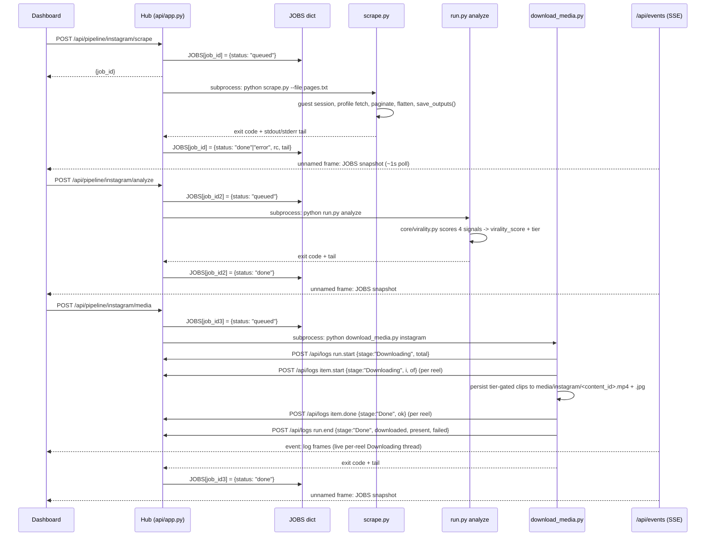

# Agent: ReelScraper

ReelScraper is the hub. It scrapes a handpicked list of creators from Instagram, X, and YouTube, scores every post with a 4-signal virality engine, and serves the entire `/api/*` contract that every other agent and the Dashboard depends on. It also hosts the built Dashboard frontend and the locally downloaded clip media.

!!! note "This is the settled architecture"
    Moving the hub out of `ReelScraper/` and into a shared location has been considered and rejected. The hub is deeply coupled to the scraper's `core/`, its per-platform data, and its subprocess pipeline control — and moving it would buy no additional decoupling, since the HTTP boundary already provides that. See [Architecture](architecture.md) for the full rationale.

## Responsibilities

ReelScraper owns three distinct jobs that together make it "the hub":

1. **Scrape** — pull raw posts from handpicked creator pages on Instagram, X, and YouTube.
2. **Analyze (score)** — run every post through the 4-signal virality engine and assign a tier.
3. **Serve** — expose corpus, analysis, audio, producers, studio, discovery, logs, evals, config/secrets, and SSE over `/api/*`, plus static hosting for the Dashboard build and downloaded media.

Every other agent — [AnalysisEngine](agents-analysisengine.md), [SimilarContent](agents-producers.md), [AutoSearch](agents-autosearch.md), and the [Dashboard](agents-dashboard.md) — talks to ReelScraper only through `BACKEND_API` (default `http://127.0.0.1:8787`). No agent reaches into another agent's folders. See [API Reference](api-reference.md) for the full route list.

## Guest-only Instagram access

ReelScraper and AutoSearch are the only two agents permitted to touch Instagram, and both do so read-only and guest-first.

!!! warning "Guest session, no login"
    `scrape.py` opens a **guest** session against `instagram.com` and explicitly asserts that no `sessionid` cookie is present before proceeding. If a login cookie shows up, that's treated as a bug, not a feature. Requests are paced (`PAGE_DELAY` between pages) and back off with a circuit breaker after repeated `401`/`403`/`429` responses (three strikes).

This keeps the scraper's footprint indistinguishable from an anonymous visitor browsing public profiles — no credentials to leak, no account to get flagged, and no rate-limit cliff to fall off. AutoSearch inherits the same discipline (guest-first, burner-opt-in, paced strictly slower than the scraper, with its own kill-switch) — see [Agent: AutoSearch](agents-autosearch.md).

## The three stages

ReelScraper's own slice of the [8-stage pipeline](architecture.md) is stages 3–5: Scrape, Analyze, Media.

### Scrape

`platforms/<platform>/scrape.py` reads `pages.txt` (one handle per line, human-curated or AutoSearch-approved) and, per creator:

1. `new_guest_session()` — bootstrap a guest cookie/CSRF session, assert no `sessionid`.
2. `get_profile()` — `GET` the web profile info endpoint (guest), refreshing the session on `401`/`403`, tripping a circuit breaker after 3 consecutive `429`s.
3. `fetch_page()` — paginate the clips endpoint, paced by `PAGE_DELAY`, resumable via `reels_raw*.json` checkpoint files.
4. `flatten()` — normalize pagination results into rows.
5. `save_outputs()` — write xlsx, raw JSON, and meta JSON to disk.

`scrape.py` does not call the hub's API directly — it writes local files under `platforms/<platform>/` that the analyze stage and `core/corpus.py` read afterward.

### Analyze (score)

`run.py analyze` (backed by `core/virality.py`) computes four percentile-normalized signals per post, blends them per a platform-specific weight config, and produces a single `virality_score` (0–100) plus a tier.

| Signal | What it measures (see `core/virality.py`) |
|---|---|
| `engagement_rate` | `(likes + comments + shares + saves) / followers` |
| `reach_multiplier` | `plays / followers` — how far the post traveled relative to the creator's audience size |
| `outlier_score` | `plays / that creator's median plays` — how much the post beats the creator's own baseline |
| `velocity` | `plays / days since posting` — how fast views accumulated |

Each signal is percentile-normalized within the platform's corpus, then blended using the weights in that platform's `niche_config.json` into the final `virality_score`, which is bucketed into a tier (readable via `GET /api/config/{platform}` and surfaced per-post in `GET /api/content/{platform}`).

!!! tip "Where scores show up downstream"
    The virality score and tier travel with the content row through `GET /api/content/{platform}` and `GET /api/corpus/{platform}/top`. AnalysisEngine's pending queue (`GET /api/analysis/{platform}/pending`) can filter directly on `min_score` and `tier` — the scoring stage is what makes that queue meaningful.

This stage also writes xlsx/CSV reports and indexes results into per-platform memory (`memory/<platform>/content.db`, SQLite FTS5) for `GET /api/corpus/{platform}/search`.

### Media

`download_media.py` persists the tier-gated top clips' actual video files to `media/<platform>/<content_id>.mp4` (plus a `.jpg` thumbnail), keyed by the universal `content_id`. This is what makes inline playback possible on the Dashboard board and what gives [AnalysisEngine](agents-analysisengine.md) something to point Gemini at frame-by-frame.

Selection is **governed by `niche_config.json`'s `virality.media_filter`**, not a hardcoded top-N by raw score. `download_media.py` accepts `--min-tier <label>` / `--min-score <n>` / `--top <n>`: it applies the tier/score **gate** first and only then caps to `--top`, so excluding a tier can never be topped back up with the very clips it excluded. `--min-score` overrides `--min-tier`, and `--min-tier` is mapped to a score through the platform's own tiers so the labels match the scoring engine exactly. When the hub launches this stage it forwards the resolved gate automatically: `_media_stage_cmd` calls `core/virality.resolve_media_filter` on `niche_config.json` to turn `media_filter` (`min_tier` → score, optional `min_score`, optional `max_downloads`) into `--min-score`/`--top` flags. No `media_filter` = no flags = the pre-gate top-60 behavior, unchanged.

## Scrape → Analyze → Media, end to end

Every stage is launched the same generic way: `POST /api/pipeline/{platform}/{stage}` looks up the stage in a `STAGE_CMD` table, spawns a background thread, and tracks the resulting subprocess in the module-level `JOBS` dict. The Dashboard (or a human) never runs these scripts directly — it always goes through the hub.



`analyze` and `media` follow the identical stage-runner → subprocess → `JOBS` → SSE shape as `scrape` — only the command and working directory differ. The same machinery also launches `analysis-engine`, `auto-search`, and `auto-search-beat`, which shell into the sibling `AnalysisEngine` and `AutoSearch` projects instead of running local scripts.

Both **Scrape and Media are lifecycle emitters**: `download_media.py` now speaks the same `HubEvents` vocabulary as the scraper — `run.start` / `item.start` / `item.done` / `run.end` posted to `POST /api/logs` (with a `"Downloading"` stage label) — so a media run shows up as a **live per-reel thread** on the Activity feed / Agent Desk, exactly like a scrape run, instead of being an invisible black-box job. A failed clip (usually an expired CDN link) posts an `item.done` warning rather than an `item.error`, and the run itself still exits 0.

## How the hub exposes this to the Dashboard

- `GET /api/pipeline/status` returns a point-in-time snapshot of all jobs (queued/running/done/error, return code, output tail).
- `GET /api/events` is the SSE stream. Default (unnamed) frames carry the full `JOBS` snapshot on roughly a 1-second cadence whenever it changes — this is what `usePipelineEvents()` in the Dashboard subscribes to, with a polling fallback to `GET /api/pipeline/status` if the SSE connection drops.
- Named `event: log` frames on the same stream carry newly appended entries from `POST /api/logs` (the shared lifecycle-event endpoint every agent calls) — this feeds the Activity view and the data-flow "packet" animation.

See [Dashboard](agents-dashboard.md) for how these two SSE channels compose into the live pipeline board, and [API Reference](api-reference.md) for the full `/api/pipeline/*` and `/api/events` contract.

!!! note "Interpreter selection"
    The hub prefers `ROOT/.venv/bin/python` (uv-managed) when shelling to `scrape.py`, `run.py`, or `download_media.py`, falling back to `sys.executable` if that venv isn't present.

## Running it directly

Outside of the hub-driven flow, each stage can also be run by hand from inside `ReelScraper/`:

```bash
uv run cli.py start              # boots the hub + opens the Dashboard
                                 # prefers :8787, falls back to a free port,
                                 # and prints the real one as HUB_URL=…
uv run cli.py scrape instagram   # run one stage manually
uv run cli.py analyze instagram
uv run cli.py media instagram
```

Per-platform commands are also available directly inside `platforms/<platform>/`:

```bash
uv run scrape.py --file pages.txt
uv run run.py analyze
uv run run.py search "<query>"
uv run run.py insight negative "..." --tags antipattern
```

## Related pages

- [Pipeline Overview](architecture.md) — where Scrape/Analyze/Media sit among all 7 stages.
- [API Reference](api-reference.md) — full route list, including `/api/pipeline/*`, `/api/content/*`, `/api/corpus/*`.
- [Agent: AnalysisEngine](agents-analysisengine.md) — the consumer of downloaded media and scored content.
- [Agent: AutoSearch](agents-autosearch.md) — the other Instagram-touching agent, and how its candidates feed back into `pages.txt`.
- [Architecture](architecture.md) — why the hub lives in `ReelScraper/` and won't move.
