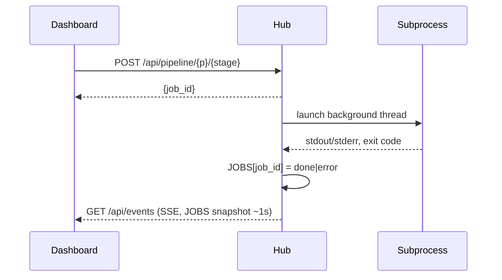

# API Reference

The hub (`ReelScraper/api/app.py`, served at `http://127.0.0.1:8787`) is the **single integration point** for the whole pipeline. Every agent — scrapers, AnalysisEngine, producers, AutoSearch, the Dashboard — reads and writes exclusively through `/api/*`. No agent touches another agent's files or folders; decoupling comes from this HTTP boundary, not from folder layout.

!!! note "Auto-generated interactive contract"
    Every request body in this API is a typed Pydantic model, so FastAPI serves a live, always-accurate contract at **`/docs`** (Swagger UI). Treat this page as a guided map of that contract, grouped by resource — for exhaustive field-level detail, open `/docs` against a running hub.

For how these calls compose into end-to-end flows, see [Agent Call Flows](architecture.md). For where the underlying data lives on disk, see [Architecture](architecture.md).

## Join keys

Three IDs tie the whole surface together. Keep them in view while reading the tables below.

| Key | Scope | Appears in |
|---|---|---|
| `content_id` | universal content join key | `platforms/<p>/content.json` rows, `media/<p>/<content_id>.{mp4,jpg}`, `analysis/<p>/<content_id>.json`; aliased as the discovery board's gate-join key for discovery-kind producers |
| `audio_id` | sound join key, parallel to `content_id` | `content.json` rows' `audio_*` fields, `GET /api/audio/{p}/sound/{audio_id}`, the trending table |
| `candidate_id` | discovery join key | stable `cand_<sha1(platform:handle)[:10]>` (or agent-supplied); identifies one creator candidate across `discovery/{p}/candidates.json` and `discovery/{p}/gate.jsonl` |

`run_id` is a fourth, lighter-weight key: it links one curated lifecycle event in `logs/agents.jsonl` back to an agent's own full-fidelity local JSONL log, and groups a run's items in `GET /api/agents/{name}/board`.

---

## Platforms

| Method & path | Purpose |
|---|---|
| `GET /api/platforms` | Supported platforms (`instagram`, `x`, `youtube`), each with a summary and a per-stage readiness map. See below. |

### The platform summary

Counts here belong to **different stages**, and mixing them up is the classic way to
report a working pipeline as an empty one.

| Field | Comes from | Non-zero after |
|---|---|---|
| `watchlist` | `pages.txt` | you add a handle |
| `scraped_items` | `<content>_raw*.json` | `scrape` |
| `scraped` | same files, as a boolean | `scrape` |
| `items` · `creators` · `viral` | `content.json` | `analyze` |
| `media_ready` | `media/<p>/*.mp4` | `media` |
| `analyzed` | blueprint coverage | `analysis-engine` |
| `has_data` | `content.json` exists | `analyze` |

`scraped && !has_data` means the scrape finished but nothing has scored it — reels are on
disk and every corpus view stays empty until `analyze` runs. `watchlist` is **not**
`creators`: the latter counts the scored corpus, so it reads 0 for a handle you added a
moment ago. All of these are read from the filesystem, so they survive a hub restart; the
job ledger does not.

### `readiness`

A map of stage → `{ready, blocked_by, reason}`, reporting each stage's precondition
*before* it is launched. The stages have always refused cleanly when their input is missing
("no scraped data — scrape first"), but only after being spawned, so the reason arrived as
a subprocess tail.

`blocked_by` names a stage you can run to clear the block — following it terminates at
something only a human can do (add a handle, set an API key), at which point `blocked_by`
is `null` and `reason` says what that is.

```json
"readiness": {
  "scrape":  {"ready": false, "blocked_by": null,      "reason": "No creators on the watchlist. Add a handle in Config first."},
  "analyze": {"ready": false, "blocked_by": "scrape",  "reason": "Nothing scraped yet — run Scrape first."},
  "media":   {"ready": false, "blocked_by": "analyze", "reason": "No scored corpus yet — run Analyze first."}
}
```

---

## Config

| Method & path | Purpose |
|---|---|
| `GET /api/config/{platform}` | Read the platform's `niche_config.json` (weights/tiers/keywords) plus its `pages.txt` lines. |
| `PUT /api/config/{platform}` | Whole-file overwrite of config and/or pages. |
| `GET /api/config/agent/{agent}` | Read a producer/agent's hub-stored config; defaults are populated from its registered manifest's `config_schema`. |
| `PUT /api/config/agent/{agent}` | Write an agent's config — the Dashboard renders this as a schema-driven form. |
| `GET /api/config/agent/{agent}/secrets/status` | Presence-only secret status; never returns values. |

```json title="PUT /api/config/{platform} — ConfigUpdate"
{
  "config": { "...": "whole niche_config.json, optional" },
  "pages": ["creator_handle_one", "# comment lines preserved", "creator_handle_two"]
}
```

```json title="PUT /api/config/agent/{agent} — AgentConfigIn"
{ "config": { "discovery_enabled": false, "...": "per config_schema" } }
```

!!! warning "Secrets never leave the local agent"
    The hub stores only the **name** of an environment variable a secret is expected in (e.g. `GEMINI_API_KEY`), never its value. `secrets/status` reports `{name, env_var, present, required}` so the Dashboard can show a red/green badge without ever seeing a key.

---

## Content

| Method & path | Purpose |
|---|---|
| `GET /api/content/{platform}` | Normalized board rows: `content_id`, creator, virality score/tier, media URLs (mp4/jpg presence), audio fields, `analyzed` flag. |

This is the read model every producer starts from — one row per scraped piece of content, already joined against scoring and media state.

---

## Corpus

Read-only adapter (`core.corpus.Corpus`) over a platform's scored content, used to ground producer prompts and dashboard charts.

| Method & path | Purpose |
|---|---|
| `GET /api/corpus/{platform}/factors` | Virality-factor breakdown for the platform's corpus. |
| `GET /api/corpus/{platform}/top?n=15` | Top-N viral clips. |
| `GET /api/corpus/{platform}/brief?q=` | Narrative brief for a producer prompt; embeds a "Visual formulas" section pulled from analyses (reads `virality_formula`, falls back to lean fields). |
| `GET /api/corpus/{platform}/search?q=&k=10` | Recall search over the corpus/memory (SQLite FTS5). |

---

## Studio + human gate

Producers write generation output here as markdown proposals; a human approves or rejects before anything posts.

| Method & path | Purpose |
|---|---|
| `GET /api/studio/{platform}?status=&agent=` | Filterable list of proposals (`status` ∈ `draft` / `proposed` / `approved` / `rejected`; filter by producer `agent`). |
| `GET /api/studio/{platform}/{file}` | One studio item by filename — so a producer rendering a single approved item doesn't have to fetch and filter the whole list. |
| `POST /api/studio/{platform}` | Save a proposal (upsert by filename). |
| `POST /api/studio/{platform}/{file}/status` | Record a human-gate decision. |
| `POST /api/studio/{platform}/{file}/render` | Render ONE approved item. Launches the producer that **wrote** the item, resolved from the registry — the hub names no agent. Body: `{"force": bool}` (optional). |

```json title="POST /api/studio/{platform} — Proposal"
{
  "text": "# Full markdown proposal, including the mandatory ## Audio block",
  "filename": "2026-07-18-similar-content-hook-remix.md",
  "agent": "similar-content",
  "kind": "clone",
  "status": "proposed"
}
```

`kind` is one of `clone` / `proposal` / `idea` / `template`. Filenames follow `<date>-<agent>-<slug>.md`; sidecar metadata lands in `studio/{p}/meta.json`.

!!! important "`status` is preserved, not defaulted, on re-POST"
    Omitting `status` does **not** mean "proposed". The hub resolves it as
    `body.status or previous.status or "proposed"` — so an explicit `status`
    (or a first insert) is the only thing that moves an item's gate state.

    This matters because producers re-POST their own markdown: SimilarContent
    stamps rendered-media info back onto the item after a render. Without
    preservation, that write would silently reset a human's `approved`
    decision back to `proposed` and un-gate the item. Producers deliberately
    omit `status` on re-POST for exactly this reason.

`GET /api/studio/{platform}/{file}` returns the same row shape as the list route. Legacy `.md` files with no sidecar metadata read as status `draft`.

### Rendering an approved item

`POST /api/studio/{p}/{file}/render` is the human-triggered render trigger behind the Studio's **Render** button:

- **409** if the item is not `approved`, or if it has no producing `agent` recorded.
- The producer is resolved from the item's `agent` field, then from that agent's registered manifest (`renderable`, `dir`, `render_cmd`) — see [Producers & SPI](agents-producers.md).
- The job id is deterministic (`{platform}:render:{file}`) rather than sequence-numbered, so it doubles as a per-item lock: a second call while one is in flight returns `{"job_id": ..., "already_running": true}` instead of starting a duplicate paid render.

```json title="POST /api/studio/{platform}/{file}/render — RenderRequest"
{ "force": false }
```

```json title="POST /api/studio/{platform}/{file}/status — StatusUpdate"
{ "status": "approved", "note": "optional reviewer note" }
```

Decisions append to `studio/{p}/gate.jsonl` and are never emitted by the producer itself — see [Agent Call Flows](architecture.md) for how the board reflects `Approved`/`Rejected`.

---

## Renders (producer-generated media)

Where a producer uploads the finished artifact. **Generated media lives in its own namespace**, `renders/<platform>/<render_id>/`, served at `/renders` — structurally separate from `/media`, which holds the scraped corpus keyed by `content_id`.

!!! danger "Renders must never be written into `media/`"
    Overwriting a corpus file there makes the hub serve our own output under a real creator's `content_id`, with metrics that no longer describe the video. That has happened once. The separation is now enforced in code, not by convention: an assertion refuses to start if the two namespaces resolve to the same directory, and asset names matching the scraped-corpus shape (`<15+ digit id>_<user id>.<ext>`) are rejected outright.

| Method & path | Purpose |
|---|---|
| `POST /api/renders/{platform}` | A producer uploads a rendered artifact plus its metadata. Upsert, keyed on the studio filename. |
| `GET /api/renders/{platform}?file=&agent=&kind=` | List renders, newest first. Filterable by studio file, producer, or kind. |
| `GET /api/renders/{platform}/{render_id}` | One render record. |
| `DELETE /api/renders/{platform}/{render_id}` | Delete a render — removes the index entry and the on-disk directory. |

```json title="POST /api/renders/{platform} — RenderIn (abridged)"
{
  "file": "2026-07-18-similar-content-hook-remix.md",
  "agent": "similar-content",
  "kind": "slideshow",
  "caption": "…", "hashtags": ["…"],
  "duration_s": 14.2, "width": 1080, "height": 1920, "fps": 30,
  "aspect_ratio": "9:16", "video_fit": "cover",
  "has_audio": false, "provider": "nano_banana",
  "frames": [{ "frame": 0, "on_screen_text": "…", "duration_s": 1.2 }],
  "assets": [{ "name": "reel.mp4", "content_b64": "…", "content_type": "video/mp4" }]
}
```

- **`file` is the join key.** It must name an existing studio item; the `render_id` is derived from it **server-side** (never client-supplied), so one studio item maps to exactly one render directory. That makes re-rendering idempotent — it overwrites in place — and removes path traversal as a possibility at the source.
- **`kind`** ∈ `slideshow` / `video`. The model is deliberately technique-agnostic: a future video-generation agent posts `kind: "video"`, `has_audio: true` and an empty `frames[]` against this same shape.
- **Assets are base64-in-JSON**, not multipart — `python-multipart` is not a hub dependency and every producer speaks hand-rolled stdlib `urllib`, so this keeps both sides dependency-free. Names must match `^[a-z0-9][a-z0-9._-]{0,63}$` with an extension in `.mp4/.jpg/.jpeg/.png/.webp`. The payload cap is **64 MB** (`413` beyond it). Each file is written to a `.part` and atomically renamed, so readers see the old file or the new one, never a torn one.

Responses hydrate the stored record with served URLs:

```json
{
  "render_id": "2026-07-18-similar-content-hook-remix",
  "video_url":  "/renders/instagram/<id>/reel.mp4?v=1750000000000",
  "poster_url": "/renders/instagram/<id>/poster.jpg?v=1750000000000",
  "local_path": "/…/ReelScraper/renders/instagram/<id>/reel.mp4",
  "bytes": 2411004
}
```

The `?v=` token is `updated_at` **in milliseconds**. Without it a re-render keeps showing the previous video, since the URL is otherwise unchanged; seconds would collide for two renders inside the same second. `local_path` is what the Dashboard offers for manual upload.

Per-item `render.json` files are the source of truth; `renders/index.json` is a derived cache rebuilt from them at startup, so a truncated or hand-edited index self-heals instead of silently hiding renders.

---

## Analysis (blueprints)

AnalysisEngine watches downloaded clips frame-by-frame and writes rich, generation-ready **blueprints** here — the shared substrate every producer reads.

| Method & path | Purpose |
|---|---|
| `GET /api/analysis/{platform}` | List all saved analyses for the platform. |
| `POST /api/analysis/{platform}` | Save an analysis (blueprint). |
| `GET /api/analysis/{platform}/pending?min_score=&tier=&min_duration=&max_duration=&content_type=&limit=&reanalyze=<id>&stale=true` | The analysis work queue — top-viral clips with media downloaded but not yet analyzed, or flagged for re-analysis; also surfaces reference (`is_reference`) items. |
| `GET /api/analysis/{platform}/{content_id}` | Fetch one blueprint. Also serves `ref_<hash>` reference blueprints via the same route. |

```json title="POST /api/analysis/{platform} — VideoAnalysisIn (abridged)"
{
  "content_id": "required",
  "schema_version": 2,
  "url": "...",
  "model": "gemini-...",
  "analyzed_by": "analysis-engine",
  "duration_s": 14.2,
  "is_reference": false,

  "video_metadata": { "...": "..." },
  "global_style": { "...": "..." },
  "audio": { "...": "..." },
  "audio_strategy": { "...": "..." },
  "characters_and_subjects": [ "..." ],
  "text_overlays": [ "..." ],
  "shots": [ { "generation_prompt": "...", "negative_prompt": "..." } ],
  "regeneration_guide": { "...": "..." },
  "virality_formula": { "...": "..." },
  "evaluation": { "...": "..." }
}
```

!!! note "Backward compatible with schema v1"
    Older lean documents (no `schema_version`, just `summary`/`hook`/`beats`/`visual_style`/`subjects`/`setting`/`text_overlay`/`pacing`/`retention_devices`/`cta`/`tags`/`replicable_formula`) still validate against this same endpoint.

---

## Audio

| Method & path | Purpose |
|---|---|
| `GET /api/audio/{platform}/trending?window=14d&limit=50&reusable_only=&mood=&min_trend=` | Trending-sound table — adoption velocity *within tracked creators*. |
| `GET /api/audio/{platform}/sound/{audio_id}` | Detail for one sound. |

!!! warning "Not a true platform-wide chart"
    The trending table measures adoption velocity within the creators you already track, not platform-wide popularity. This is an honest MVP limitation, not a bug.

Trending rows: `{audio_id, title, artist, is_original, is_reusable, sound_page_url, uses_in_corpus, trend_score, bucket, example}`, where `bucket` ∈ `Rising` / `Hot` / `Saturated` / `Evergreen`.

---

## Producers

The registry is the pluggability backbone: any agent can self-register and immediately appear as a lane in the Dashboard.

| Method & path | Purpose |
|---|---|
| `POST /api/producers/register` | Idempotent upsert by `name` — a producer manifest. |
| `GET /api/producers` | Full roster; the Dashboard renders lanes directly from this list. |
| `GET /api/producers/{name}` | One producer's manifest. |

```json title="POST /api/producers/register — ProducerManifest"
{
  "name": "similar-content",
  "kind": "clone",
  "consumes": ["corpus", "analysis", "audio"],
  "human_gate": false,
  "needs_reference": false,
  "produces": "studio_markdown",
  "output_status": "proposed",
  "config_schema": { "...": "..." },
  "secrets": [{ "name": "NVIDIA_API_KEY", "env_var": "NVIDIA_API_KEY", "required": true }],
  "workflow_stages": ["Queued", "Generating", "Self-eval", "Proposed", "Approved", "Rejected"]
}
```

---

## Discovery (AutoSearch)

AutoSearch, the "front door," searches for new creators and posts candidates here for human review.

| Method & path | Purpose |
|---|---|
| `POST /api/discovery/{platform}` | Ingest/upsert one candidate. |
| `GET /api/discovery/{platform}?status=` | Candidate rows, newest-first, with a derived `in_pages` flag. |
| `GET /api/discovery/{platform}/pending` | The human review queue. |
| `POST /api/discovery/{platform}/{candidate_id}/status` | The gate: approve or reject a candidate. |

```json title="POST /api/discovery/{platform} — CandidateIn"
{
  "candidate_id": "optional — else cand_<sha1(platform:handle)>[:10]",
  "handle": "some_creator",
  "platform": "instagram",
  "source_term": "productivity hacks",
  "discovered_via": "related-creator-chaining",
  "followers": 84000,
  "median_plays": 120000,
  "sample_reels": ["..."],
  "relevance": { "score": 0.82, "reasons": ["niche fit", "engagement pattern"] }
}
```

`candidate_id` upserts — never dupes — and status is hub-forced to `pending` on first insert. Re-ingesting an already-approved or -rejected candidate never silently un-gates it.

```json title="POST /api/discovery/{platform}/{candidate_id}/status — StatusUpdate"
{ "status": "approved", "note": "optional reviewer note" }
```

On `approved`, the hub appends the handle to `pages.txt` via a safe, comment-preserving, deduped helper (never a whole-file overwrite), and records the outcome — including `appended_to_pages` — to `discovery/{p}/gate.jsonl`.

---

## Logs

A curated, cross-agent lifecycle log; every agent's `POST /api/logs` call feeds both the central log and the SSE `log` channel.

| Method & path | Purpose |
|---|---|
| `POST /api/logs` | Append a curated lifecycle event. |
| `GET /api/logs?agent=&level=&since=&run_id=` | Query the central log. |

```json title="POST /api/logs — LogIn"
{
  "agent": "analysis-engine",
  "level": "info",
  "event": "item.done",
  "msg": "optional human-readable message",
  "run_id": "run-2026-07-18-1",
  "platform": "instagram",
  "content_id": "abc123",
  "data": { "stage": "Done", "score": 0.91 }
}
```

`run_id` links back to the agent's own full-fidelity local JSONL log file. The fine-grained per-item event vocabulary is: `item.start` (`data.stage`), `item.stage` (mid-item transition), `item.error` (routes to the implicit **Failed** lane), and `item.done` (terminal stage; producers include `data.file` for the studio gate-join).

---

## Evals

| Method & path | Purpose |
|---|---|
| `POST /api/evals` | Record a self-eval or judge score. |
| `GET /api/evals?agent=&target_type=&since=` | Query eval history — feeds Dashboard score-trend charts. |

```json title="POST /api/evals — EvalIn"
{
  "agent": "similar-content",
  "target_type": "clone",
  "target_id": "2026-07-18-similar-content-hook-remix.md",
  "scores": { "overall": 0.87, "per_criterion": { "fidelity": 0.9, "hook_strength": 0.85 } },
  "verdict": "accept",
  "judge": "similar-content/self",
  "notes": "optional",
  "platform": "instagram"
}
```

`target_type` is one of `blueprint` / `clone` / `proposal` / `idea` / `audio` / …, matching whatever the producer just generated. Results are stored at `evals/<agent>/<id>.json` and appended to `evals.jsonl`.

---

## Agents / board

| Method & path | Purpose |
|---|---|
| `GET /api/agents/{name}/board?platform=&limit_runs=10` | Reduces `logs/agents.jsonl` into `runs → items → current stage` for one agent's live workflow board. |

The reducer left-joins gate outcomes onto the reduced stream:

- **Producers** (studio kind) are joined by filename via `data.file` against `studio/{p}/gate.jsonl`.
- **Discovery** producers are joined by `content_id == candidate_id` against `discovery/{p}/gate.jsonl` (no `data.file`).

Lane labels come from the producer manifest's `workflow_stages` (e.g. an analyzer: `Queued` / `Analyzing` / `Self-eval` / `Done`; a producer: `Queued` / `Generating` / `Self-eval` / `Proposed` / `Approved` / `Rejected`). **Failed** is an implicit terminal lane, shown only when occupied.

---

## Pipeline + Events

Stage jobs are launched generically and tracked as background subprocesses; the SSE stream is how the Dashboard watches them live.

| Method & path | Purpose |
|---|---|
| `POST /api/pipeline/{platform}/{stage}` | Launch a single stage subprocess job. `stage` ∈ `scrape`, `analyze`, `media`, `analysis-engine`, `auto-search`, `auto-search-beat`, `render`. Returns `{job_id}`. **409** with the reason when the stage's input is not ready (see `readiness` above); `?force=true` overrides — readiness is a convenience, not a security boundary. |
| `POST /api/pipeline/{platform}/run-all` | Launch the one-click core pipeline: the stages in `RUN_ALL_STAGES` (`scrape → analyze → media → analysis-engine`) chained in order. **`render` is deliberately excluded** — it spends model credits and only runs on an explicit per-item human trigger. Returns `{run_id, stages}`; every stage job of the run carries that `run_id`. **409** if a run is already in flight for the platform, or if the first stage cannot run. |
| `GET /api/pipeline/status` | Snapshot of all jobs (queued/running/done/error, return code, output tail, `run_id`). |
| `GET /api/schedule` | Per-platform automatic-run settings, plus the derived `stages` and `next_run_at`. |
| `PUT /api/schedule/{platform}` | `{enabled?, every_hours?, include_blueprints?}` — every field optional. |
| `GET /api/events` | SSE stream — see below. |

!!! note "A stage's failure tail carries both streams"

    `JOBS[...].tail` is stdout **and** stderr, stderr last so truncation eats routine
    progress rather than the error. It used to be `stdout or stderr`, which meant any
    stage that printed a progress line lost its entire stderr — discarding the reason in
    exactly the case anyone needed it.

### Scheduled runs

`GET /api/schedule` returns a row per platform:

```json
{"instagram": {"enabled": false, "every_hours": 24, "include_blueprints": false,
               "last_run_at": 0, "stages": ["scrape", "analyze", "media"],
               "next_run_at": null}}
```

**The hub must be running.** There is no daemon outside it — deliberately, since the
project depends on no cron and no hosted service — so a schedule is best-effort "while you
have this open", not a guarantee.

Scheduled runs do **free stages only** (`scrape → analyze → media`). `analysis-engine`
calls a paid API once per clip, and unattended on a daily timer that adds up, so it is
opt-in per platform via `include_blueprints` — the same reasoning that keeps `render` out
of `RUN_ALL_STAGES`.

Behaviour worth knowing:

- `last_run_at` is persisted and stamped **before** the run launches, so a run that outlives
  the tick interval cannot come due again mid-flight, and restarting the hub neither
  re-fires nor loses the schedule.
- Enabling stamps the clock, so switching it on does not immediately fire.
- A platform with no watchlist is skipped quietly rather than starting a run that exists
  only to fail.
- The config read fails closed: any problem resolves to disabled.

`analysis-engine` shells out to the sibling `../AnalysisEngine` (`uv run cli.py run <p>`); `auto-search` / `auto-search-beat` shell out to `../AutoSearch` (`uv run cli.py run|beat <p>`). Every other stage runs in-process inside `ReelScraper`.



!!! tip "Two SSE channels on one connection"
    `GET /api/events` multiplexes two kinds of frames on a single `EventSource`:

    - **Default (unnamed) frames** carry the full `JOBS` snapshot roughly every second — a push replacement for polling `/api/pipeline/status`.
    - **Named `event: log` frames** carry new central log records (from `POST /api/logs`) since the client connected — this feeds the Dashboard's Activity view and the data-flow "packet" animation.

    The Discovery heartbeat thread (idle unless `discovery_enabled`) also shows up here as ordinary job events when it fires.

---

## Static mounts

Mounts resolve in registration order, so the specific ones are registered before the `/` catch-all.

| Method & path | Purpose |
|---|---|
| `/media/*` | Static, range-request-capable mount serving `ROOT/media/` — the **scraped corpus**: local video/thumbnail files for inline board playback. |
| `/renders/*` | Static, range-request-capable mount serving `ROOT/renders/` — **producer-generated** reels, kept structurally separate from the corpus (see [Renders](#renders-producer-generated-media)). Range requests are what let the Studio play them inline. |
| `/documentation/*` | Static mount serving this MkDocs site from `documentation/site/`, **mounted only if that directory exists at hub startup**. Build it with `./docs --build`, then restart the hub — the check happens once, at import time. |
| `/favicon.ico` | Route (not a mount), registered before `/`. Serves `frontend/dist/favicon.ico`; 308-redirects to `favicon.svg` for older builds that shipped only the SVG; 404 if the frontend is not built. |
| `/` | Serves the built Dashboard from `ROOT/frontend/dist`. Resolved **per request**: when `frontend/dist/index.html` is absent it returns a self-refreshing "Building the dashboard…" page with **HTTP 503** (not a static one-time page), which reloads itself and starts serving the app the moment the build lands — no hub restart needed. |
| `/docs` | FastAPI's auto-generated interactive contract (Swagger UI) — every request body above is a typed Pydantic model, so this stays exactly in sync with the live API. |

---

## Insights and reference/template ingestion

Two smaller resource groups worth knowing about, referenced elsewhere in this reference:

- **Insights** (`GET`/`POST /api/insights`) — the shared cross-agent learning exchange. Each producer run posts at most one transferable finding.
- **Reference ingestion** (`POST`/`GET /api/reference/{platform}`, `GET /api/reference/{platform}/pending`) — the only path a producer needing external material (the template-content producer) uses to pull in a reference video by URL. References are assigned a synthetic `ref_<hash>` id and are explicitly **not** corpus content — not scored, not a real reel. Once analyzed, a reference is served through the normal analysis route, `GET /api/analysis/{platform}/{ref_id}`, saved with `is_reference: true`.

---

## See also

- [Architecture](architecture.md) — component ownership and on-disk storage layout behind this API.
- [Agent Call Flows](architecture.md) — the exact sequence of calls each agent makes against this contract.
- [Pipeline Stages](architecture.md) — how these endpoints compose into the 7-stage Discover → Studio pipeline.
