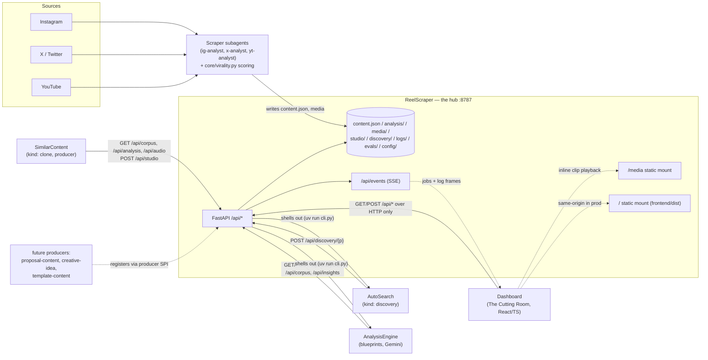
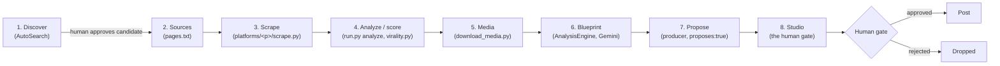

# Architecture

The pipeline is a set of independent agents that never talk to each other directly. Every read and
every write goes through one FastAPI service — **the hub** — over plain HTTP. This page covers the
component map, the 8-stage data flow, the on-disk storage layout, the memory model, and the
platform-wide concerns (logging, evals, config, secrets) that every agent implements the same way.

!!! note "The one integration principle"
    The hub (`ReelScraper`, served at `http://127.0.0.1:8787`) is the **single integration point**.
    Agents read and write only via `/api/*` and never touch another agent's files or folders.
    Decoupling comes from the HTTP boundary, not from folder layout. See the full contract in
    [API Reference](api-reference.md).

## Component map



### Roster

| Component | Role | Talks to hub via |
|---|---|---|
| **ReelScraper** | The hub itself. Scrapes handpicked creator pages, scores virality (4-signal engine), and serves the entire `/api/*` contract, the built Dashboard, and local `/media` files. | — (is the hub) |
| **AnalysisEngine** | Watches top clips frame-by-frame with Gemini and writes generation-ready blueprints (`schema_version 2`). The shared substrate every producer reads. | `/api/analysis`, `/api/corpus`, `/api/insights`, `/api/reference` |
| **SimilarContent** | A producer (`kind: clone`) that recreates a winning clip 1:1 from its blueprint's `shots[]` and `regeneration_guide`. | `/api/corpus`, `/api/analysis`, `/api/audio`, `/api/studio` |
| **AutoSearch** | The "front door" (`kind: discovery`). Searches Instagram for new creators, scores niche-fit, and posts candidates for human review. | `/api/discovery`, `/api/config`, `/api/corpus/{p}/factors`, `/api/insights` |
| **Dashboard** | "The Cutting Room" — React 19 + TS + Vite + Tailwind v4 control board. Renders producer lanes, the human gate, sounds, blueprints, activity, and discovery. | all read routes, plus the human-gate `POST` routes |
| **`_producer-template/`** | Scaffold for spinning up new producers (`cp -r _producer-template <Dir>`). | registers via the same producer SPI |

!!! tip "Settled decision, not a TODO"
    The hub staying inside `ReelScraper/` — rather than moving to the repo root — is a deliberate
    architectural call: it's deeply coupled to the scraper's `core/`, its per-platform data, and its
    subprocess pipeline control. Moving it would buy no additional decoupling, since HTTP already
    provides that boundary.

## The 8-stage data flow

Discovery was prepended to an originally 6-node board (Sources → Scrape → Analyze → Media →
Blueprint → Studio) once AutoSearch was added. Propose was later split out of Studio when
producing a recipe became a pipeline stage the hub can launch on its own — so Studio is now
purely the human gate, and Propose is the step that fills it. That makes 8 stages end to end.



| Stage | Owner | Produces |
|---|---|---|
| 1. Discover | AutoSearch | candidate records pending human review (`POST /api/discovery/{p}`) |
| 2. Sources | `pages.txt` (human-curated or auto-search-approved) | the handle/link list a scrape run consumes |
| 3. Scrape | `platforms/<p>/scrape.py` | raw per-post JSON → `content.json` after normalize (metrics, captions, media URLs — CDN links expire in hours) |
| 4. Analyze / score | `run.py analyze` + `core/virality.py` | the 4-signal engine (`engagement_rate`, `reach_multiplier`, `outlier_score`, `velocity`), percentile-normalized and blended into a `virality_score` (0-100) + tier; xlsx/CSV reports; indexed memory |
| 5. Media | `download_media.py` | top-viral clips persisted to `media/<p>/<content_id>.mp4` (+ `.jpg`) for inline board playback and for AnalysisEngine to watch |
| 6. Blueprint | AnalysisEngine | schema_version-2 blueprint via `POST /api/analysis/{p}`: `video_metadata`, `global_style`, `audio`, `audio_strategy`, `characters_and_subjects[]`, `text_overlays[]`, `shots[]` (each with `generation_prompt`/`negative_prompt`), `regeneration_guide`, `virality_formula`, `evaluation` |
| 7. Propose | the one producer declaring `proposes: true` (SimilarContent today) | ranks the corpus by how cheap each winner is to remake (`score_ease`), joins each pick to its blueprint, and writes a recipe. Launchable as a stage (`POST /api/pipeline/{p}/propose`) and the last boundary the [cascade](api-reference.md#the-cascade) fires unattended. Free — it reads blueprints and writes markdown |
| 8. Studio | `POST /api/studio/{p}` + the gate | markdown proposals (mandatory `## Audio` block), gated by human approve/reject before posting. Approved items become renderable |

!!! note "Naming: Blueprint, not Analyze"
    Stage 6 is labeled **Blueprint** on the pipeline board, not "Analyze," specifically to avoid
    confusion with stage 4's virality scoring — the two are unrelated uses of "analysis" in this
    system.

See [Pipeline Stages](architecture.md) for the per-stage CLI commands and job lifecycle, and
[Agents](agents-reelscraper.md) for each agent's full call sequence against the hub.

## On-disk storage layout

Everything lives inside `ReelScraper/` (`ROOT` below is that repo root). Sibling repos —
`AnalysisEngine/`, `SimilarContent/`, `Dashboard/`, `AutoSearch/`, and `_producer-template/` — sit
alongside it under the parent directory and never read these paths directly; they only call
`BACKEND_API`.

```text
core/                      shared, platform-agnostic engine
  schema.py                the normalized Content record every platform emits
  virality.py              4-signal scoring engine + Excel/CSV reports
  memory.py                ContentMemory (per-platform) + SharedInsights (cross-agent)
  runner.py                shared run.py CLI (analyze|search|insight|insights)
  corpus.py                the read adapter behind /api/corpus/*
  audio.py                 sound_trend_score + bucket computation
  logsetup.py              shared production logging convention
platforms/<p>/             per-platform adapter (instagram|x|youtube)
  scrape.py, normalize.py, run.py, niche_config.json, pages.txt
  content.json             normalized scraped rows — has content_id per row
memory/<p>/                per-platform memory: MEMORY.md, patterns.md, persona.md, decisions.jsonl, content.db (SQLite FTS5)
memory/shared/              ONLY cross-agent channel: METHOD.md, INSIGHTS.md, insights.jsonl
logs/                       per-invocation logs (git-ignored); agents.jsonl = central curated LIFECYCLE log
api/app.py                  the hub itself (REST + SSE + media + serves frontend build)
cli.py                      single entry point: start | scrape | analyze | media
download_media.py           persists top videos to media/ for inline play
media/<p>/<content_id>.mp4|.jpg   downloaded top-viral clip media; ref_*.mp4 for references
renders/<p>/<render_id>/    producer-GENERATED reels (reel.mp4 + poster.jpg + render.json); render_id derived server-side from the studio filename. STRICTLY separate from media/ (scraped corpus); mounted at "/renders"
studio/<p>/                 generated proposals (markdown) + meta.json sidecar + gate.jsonl
analysis/<p>/                blueprints keyed <content_id>.json; ref_<hash>.json for references
producers/registry.json     self-registered producer manifests
references/<p>/registry.json ad-hoc reference/template videos (ref_<hash>) metadata
discovery/<p>/candidates.json  creator candidates from auto-search
discovery/<p>/gate.jsonl    candidate approve/reject decision log
evals/<agent>/<id>.json + evals.jsonl   self-eval/judge results
config/agents/<agent>.json  per-agent config (Dashboard-editable)
.claude/agents/              ig-analyst + x-analyst + yt-analyst — the hub's own scraper subagents
frontend/dist/               the built Dashboard (mounted at "/" by the hub)
```

### Join keys

| Key | Ties together |
|---|---|
| `content_id` | `platforms/<p>/content.json` rows, `media/<p>/<content_id>.{mp4,jpg}`, `analysis/<p>/<content_id>.json` blueprints. Also used as an alias of `candidate_id` in AutoSearch's board gate-join. |
| `audio_id` | `content.json` rows' `audio_*` fields, `GET /api/audio/{p}/sound/{audio_id}`, and the trending-sound table. |
| `candidate_id` | Stable `cand_<sha1(platform:handle)[:10]>` (or agent-supplied); identifies one creator candidate across `discovery/{p}/candidates.json` and `discovery/{p}/gate.jsonl`. Doubles as `content_id` in the agent board's gate-join for discovery-kind producers (no `data.file`, unlike studio's file-keyed join). |
| `run_id` | Links a central `logs/agents.jsonl` lifecycle event back to an agent's own full-fidelity local per-run JSONL log; groups a run's items in `GET /api/agents/{name}/board`. |

## Memory model

Memory splits cleanly along the same integration boundary as everything else: what belongs to one
agent's own operation stays local; what's worth transferring across agents goes through the hub.

- **Per-agent memory** — each platform adapter keeps `memory/<p>/MEMORY.md`, `patterns.md`,
  `persona.md`, `decisions.jsonl`, and a SQLite FTS5 index (`content.db`) that backs
  `GET /api/corpus/{p}/search`. Each sibling agent (AnalysisEngine, SimilarContent, AutoSearch) also
  keeps its own local memory files it reasons over per run — these are never read by any other
  agent directly.
- **Shared insights** — the only cross-agent memory channel is `memory/shared/` (`METHOD.md`,
  `INSIGHTS.md`, `insights.jsonl`), exposed over HTTP as `GET/POST /api/insights`. Each producer run
  posts at most one transferable learning (`kind`: finding, negative, method, or idea) and reads
  prior insights before acting — for example, AutoSearch reads the prior `trending-terms` insight
  before expanding search terms.

!!! note
    No agent ever reads another agent's per-agent memory files. The shared-insights endpoint is the
    only sanctioned crossover point, which keeps the same HTTP-only integration discipline intact
    even for "soft" knowledge transfer.

## Platform-wide concerns

Every agent — analyzer or producer — implements four cross-cutting conventions identically. The
hub is the shared implementation for all of them.

### Unified logging

Each agent keeps its own full-fidelity local per-run log (pretty + JSONL, via a shared
`logsetup` convention) and additionally posts curated **lifecycle events** to the hub:

```
POST /api/logs {agent, level, event, msg?, run_id?, platform?, content_id?, ts?, data?}
```

The hub appends these to `logs/agents.jsonl`, buffers them for the SSE `log` channel on
`/api/events`, and `GET /api/agents/{name}/board` reduces the same stream per agent into
`runs → items → current stage`. The event vocabulary is shared across every agent:

```
run.start → item.start(data.stage) → item.stage(mid-item transition) → item.done(terminal stage, +data.score/+data.file for producers) → run.end
```

with `item.error` mapping to an implicit **Failed** lane on failure. Posting is best-effort and
swallowed on failure, so a hub logging outage never aborts an agent's run.

!!! warning
    `Approved` and `Rejected` are never emitted by an agent itself — they are always derived by the
    hub's board reducer left-joining a human's gate decision (`studio/{p}/gate.jsonl` by filename
    for producers, `discovery/{p}/gate.jsonl` by `content_id == candidate_id` for discovery).

### Eval pipeline

Producers and the analyzer self-score their own output and post the result:

```
POST /api/evals {agent, target_type, target_id, scores?, verdict?, judge?, notes?, platform?, ts?}
```

stored at `evals/<agent>/<id>.json` and appended to `evals.jsonl`; `GET /api/evals` feeds the
Dashboard's score-trend charts. `target_type` covers `blueprint`, `clone`, `proposal`, `idea`,
`audio`, and similar generated-artifact kinds.

### Hub-stored config

Per-agent configuration lives on the hub, not in each agent's own repo:

- `GET /api/config/agent/{agent}` — read config, with defaults populated from the agent's
  registered manifest `config_schema`.
- `PUT /api/config/agent/{agent}` — write config; the Dashboard renders a schema-driven form from
  the same `config_schema`.

Every agent fetches its config at the start of a run and merges it over local defaults, so an
operator can retune an agent (thresholds, cadence, feature flags) from the Dashboard without
touching that agent's code.

### Secrets by name

The hub never stores a secret value. Each producer manifest declares secrets by **env-var name
only**; the hub can report presence but never contents:

```
GET /api/config/agent/{agent}/secrets/status → [{name, env_var, present, required}]
```

Actual credentials (Gemini keys, Instagram session cookies) stay local to the
agent process that needs them, referenced everywhere else purely by the env-var name.

## Pipeline control

The hub implements three mechanisms for controlling when and how pipeline stages execute:

- **Manual dispatch** — `POST /api/pipeline/{platform}/{stage}` fires one stage. The hub
  checks readiness (are the preconditions met?) and returns 409 with the reason if not.
  `POST /api/pipeline/{platform}/run-all` chains `scrape → analyze → media →
  analysis-engine` in order, stopping at the first failure.
- **Timer-based schedule** (`PUT /api/schedule/{platform}`) — configurable hourly cadence
  per platform. Runs free stages only (`analysis-engine` is opt-in). Persisted across hub
  restarts and fail-closed on any config read problem.
- **Cascading heartbeat** (`PUT /api/cascade/{platform}`) — a 60s background tick that
  automatically triggers downstream stages based on input watermarks rather than wall-clock
  time. Off by default. Stages fire serially (never in parallel), and the tick respects
  backpressure from manual runs and run-all. `render` is structurally excluded — it can never
  fire through the cascade.

Any running stage can be stopped via `POST /api/pipeline/{platform}/{stage}/stop`, which
sends SIGTERM to the whole process group. The scrapers check a cooperative stop flag between
creators, so everything already saved is kept. If the process survives 20 seconds it receives
SIGKILL. Stopping a stage inside a `run-all` halts the entire run.

## Deployment note

The pipeline is designed to run **local-first**: `uv run cli.py start` inside `ReelScraper/` boots
the hub and opens the web board at `http://127.0.0.1:8787` — hub and Dashboard together are "the
product." In production the Dashboard is served **same-origin** with the hub: `api/app.py` mounts
the Dashboard's built Vite output (`frontend/dist`) at `/` via FastAPI `StaticFiles`, so there is no
separate frontend server and no cross-origin requests to reason about. Further `StaticFiles` mounts
serve `/media` (the scraped corpus) and `/renders` (producer-generated reels) — both range-request
capable for inline playback and kept structurally separate — plus `/documentation` (this MkDocs
site) when it has been built. In development the Dashboard dev server proxies `/api`, `/media` and
`/renders` to the same hub instead. Sibling
agent repos are independent `uv`-managed projects that integrate purely by calling `BACKEND_API`
(default `http://127.0.0.1:8787`) — never a hardcoded filesystem path — which keeps the whole system
portable to a different host or port with a single env-var change.

---

Continue to [Pipeline Stages](architecture.md) for stage-by-stage CLI and job-lifecycle detail, or
[API Reference](api-reference.md) for the full `/api/*` route contract.
