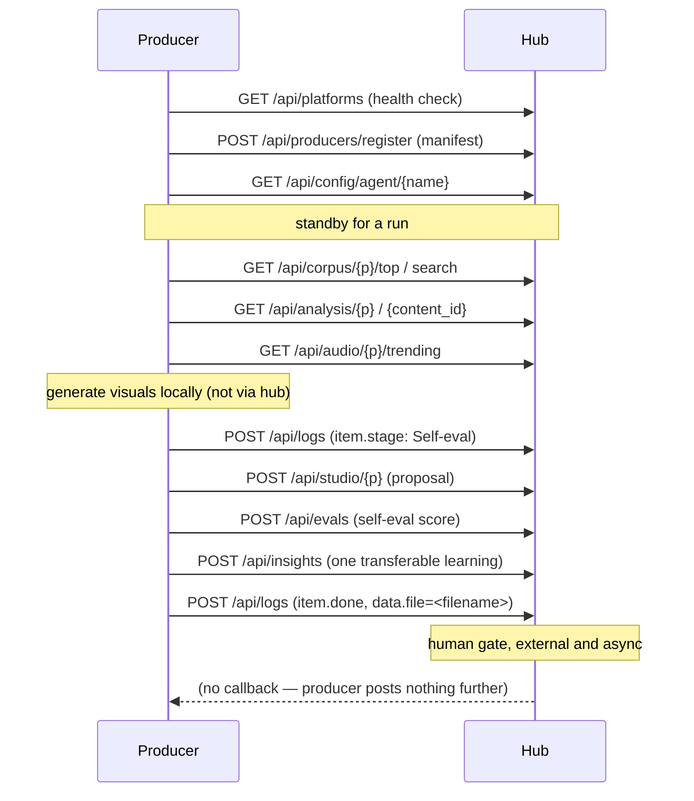
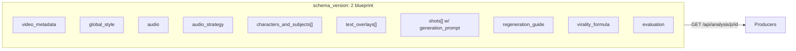
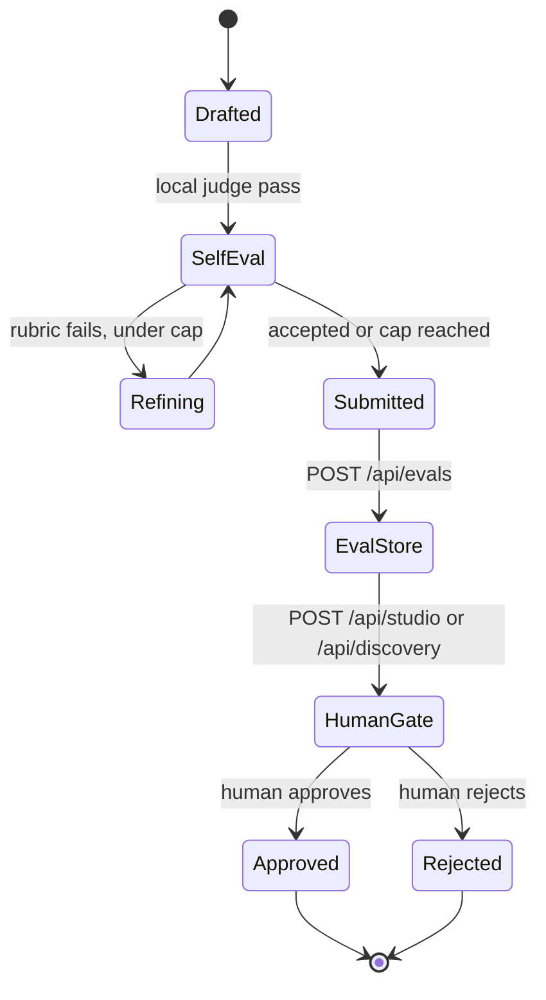
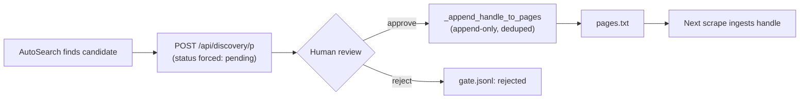

# Concepts & Design

This page goes one level deeper than [Architecture](architecture.md) into the design decisions that hold the pipeline together: the contract every producer must satisfy, the shape of an analysis blueprint, how evaluation and outcome data flow back into the system, how discovery stays safe and well-paced, how the Dashboard's agent boards are computed, and where humans sit in the loop.

If you are building a new producer, start with the [Producer SPI contract](#producer-spi-contract) and the [`_producer-template/`](architecture.md) scaffold, then read [Agent Workflow Board](#agent-workflow-board) so your event emissions render correctly.

---

## Producer SPI contract

Every producer — `SimilarContent` today, and `proposal-content` / `creative-idea` / `template-content` in the future — implements the same small service-provider interface against the hub. Nothing about a producer is hardcoded into the hub; a producer becomes visible to the whole system purely by registering.

!!! note "The one integration principle"
    The FastAPI hub at `http://127.0.0.1:8787` is the **single** integration point. Every agent reads and writes only via `/api/*`, never another agent's files or folders. Decoupling comes from the HTTP boundary, not from directory layout.

### Lifecycle



### Manifest shape

Registration is an idempotent upsert keyed by `name` — calling it again on every boot simply refreshes the manifest, it never creates duplicates.

| Field | Meaning |
|---|---|
| `name` | Unique producer identity, e.g. `similar-content`. |
| `kind` | `clone` \| `proposal` \| `idea` \| `template` \| `analyzer` \| `discovery`. |
| `consumes[]` | Upstream resources the producer reads (corpus, analysis, audio, insights). |
| `human_gate` | Whether output requires human approval before it is considered final. |
| `needs_reference` | Whether the producer requires an externally supplied reference video (only `template-content`). |
| `produces` | Output artifact type, e.g. `studio_markdown`. |
| `output_status` | Status stamped on output **when it is first created** (`proposed`, `pending`, …). A later re-POST of the same file preserves whatever status the item already has. |
| `renderable` | *Optional.* `true` opts the producer into `POST /api/studio/{p}/{file}/render` — it can turn an approved proposal into media. Omit for producers that only write markdown. |
| `dir` | *Optional, required if `renderable`.* The producer's own directory name, e.g. `SimilarContent`. Validated to be a **direct sibling** of the hub repo; it becomes the working directory of the render command. |
| `render_cmd[]` | *Optional, required if `renderable`.* The argv the hub executes there, e.g. `["uv","run","cli.py","render"]`. The launcher must be allowlisted (`uv`/`python`/`python3`/`node`/`npm`) and every argument shape-checked — see [Producers & SPI](agents-producers.md#declaring-a-render-surface). |
| `config_schema` | Schema used by the Dashboard to render an editable config form. |
| `secrets[]` | `{name, env_var, required}` — declared by env-var **name** only; values never touch the hub. |
| `workflow_stages[]` | Ordered lane labels for this producer's board. A renderable producer extends past the gate, e.g. `["Queued","Generating","Self-eval","Proposed","Approved","Rendering","Rendered","Rejected"]`. |

Together, `renderable` / `dir` / `render_cmd` are what let the hub launch a per-item render **without hardcoding any producer's name or path** — it reads them from the registry entry of whichever agent wrote the item.

!!! tip "Pluggability made visible"
    `GET /api/producers` returns the full roster. The Dashboard renders one lane set per producer straight from this list — a new producer appears in the UI automatically, with zero frontend changes, the moment it registers.

### Contract rules

- Config: `GET/PUT /api/config/agent/{agent}` — read merges hub-stored values over the producer's local defaults; write is Dashboard-editable via the registered `config_schema`.
- Secrets: `GET /api/config/agent/{agent}/secrets/status` returns presence only — `{name, env_var, present, required}` — never a value.
- Every run brackets with `POST /api/logs` `run.start` / `run.end`, and every unit of work emits `item.start → item.stage → item.done` (or `item.error`). See [Agent Workflow Board](#agent-workflow-board) for the full vocabulary.
- Producers that write proposals (not discovery candidates) **must** include `data.file` on their terminal `item.done` event — it is the join key the board reducer uses to left-join the studio gate decision.
- One transferable learning per run, posted to `POST /api/insights`, feeds [shared memory](#memory-model-shared-insights).

---

## The analysis blueprint (schema v2)

`AnalysisEngine` is the shared substrate every producer reads from. For each downloaded clip it watches the video frame-by-frame with Gemini and writes a generation-ready **blueprint** via `POST /api/analysis/{platform}`. Schema v2 is rich enough that a producer can recreate — or deliberately deviate from — the original clip without re-watching it.

!!! warning "Backward compatibility"
    Older lean v1 documents (no `schema_version` field, or `summary` / `hook` / `beats` style fields) still validate. `schema_version` only needs to be `2` to unlock the rich fields below.

### Top-level sections

| Section | Purpose |
|---|---|
| `video_metadata` | Identifying facts about the source clip — duration, platform, url, model, analyzed_by. |
| `global_style` | The overall visual/tonal register a producer should match (grading, framing conventions, mood). |
| `audio` | What sound is actually on the clip — track identity, is it original audio, mood. |
| `audio_strategy` | Whether the audio is reusable as-is or must be resourced from the trending table; guides producers' branch at generation time. |
| `characters` (`characters_and_subjects[]`) | The people/subjects on screen and their role across the clip. |
| `text_overlays[]` | On-screen text — content, timing, style — needed to reproduce captions/hooks. |
| `shots[]` | Ordered shot list, each carrying a `generation_prompt` (and typically a `negative_prompt`) usable directly by an image/video generation model. |
| `regeneration_guide` | Guidance for recreating the clip end-to-end — the field `SimilarContent` leans on hardest for 1:1 recreation. |
| `virality_formula` | The analyst's structured read of *why* this clip performed — the hook/retention mechanics a producer should preserve. |
| `evaluation` | The blueprint's own self-eval outcome — score(s) and verdict from the judge pass that produced it (see below). |



!!! note "Where references fit"
    A reference video ingested via `POST /api/reference/{platform}` (used only by `template-content`) gets the same blueprint treatment, saved with `is_reference:true` and served through the same `GET /api/analysis/{platform}/{ref_id}` route — it is analyzed but never scored as corpus content.

Read more about the stage that produces this document on [Pipeline Stages](architecture.md).

---

## The evaluation pipeline

Every analysis and every produced proposal passes through the same three-layer evaluation design (§10.2 of the pipeline spec). No agent's output reaches a human unjudged, and every judged output is durably recorded so later runs — and later agents — can learn from it.

### Layer 1 — Self-eval (in-process)

Before anything is written to the hub, the producing agent runs its own judge pass:

- `AnalysisEngine` calls a Gemini judge model against the blueprint it just drafted — hard-fail checks plus a rubric score — and will **refine** (bounded by `max_refine_passes`) and re-judge until the blueprint is accepted or the cap is hit.
- Producers (e.g. `SimilarContent`) run a local fidelity rubric against their own draft before publishing.

This layer never touches the hub — it is pure local judgment that decides whether output is good enough to submit at all.

### Layer 2 — Eval store (durable record)

Once an artifact clears self-eval, the agent submits it and separately records the judgment:

```
POST /api/evals
{ agent, target_type: blueprint|clone|proposal|idea|audio, target_id,
  scores: {overall, per_criterion}, verdict, judge, notes, platform }
```

Stored at `evals/<agent>/<id>.json` and appended to `evals.jsonl`; queryable via `GET /api/evals?agent=&target_type=&since=` and rendered as score-trend charts in the Dashboard.

### Layer 3 — Outcome loop (human gate feeds back)

The human gate decision (`approved`/`rejected` on a studio proposal or discovery candidate) is the ground-truth outcome signal. It is not a fourth API call by the agent — it is captured entirely by the hub (`studio/{p}/gate.jsonl` or `discovery/{p}/gate.jsonl`) and surfaced back into the [agent workflow board](#agent-workflow-board), closing the loop between what an agent judged good and what a human actually approved.



!!! tip "Why three layers, not one"
    Self-eval keeps obviously-bad output from ever reaching a human. The eval store makes every judgment — including self-evals that later prove wrong — auditable and chartable over time. The outcome loop is what actually tells you whether your self-eval rubric agrees with human taste; divergence there is a signal to retune the rubric, not the human.

---

## Discovery: candidate gate and anti-bot cadence

`AutoSearch` is the pipeline's "front door" — the only agent, alongside `ReelScraper` itself, permitted to touch Instagram, and it does so read-only, guest-first, burner-opt-in, and deliberately paced slower than the scraper.

### The candidate gate

Discovery never appends directly to `pages.txt`. Every creator it finds becomes a **candidate**, gated exactly like a studio proposal:

1. `POST /api/discovery/{platform}` upserts one candidate (`candidate_id` is agent-supplied or a stable `cand_<sha1(platform:handle)>[:10]` hash — re-posting the same handle updates, never duplicates).
2. The hub force-sets status to `pending` on first insert, and never silently un-gates a candidate that was already `approved` or `rejected`.
3. A human reviews the queue at `GET /api/discovery/{platform}/pending` in the Dashboard.
4. `POST /api/discovery/{platform}/{candidate_id}/status {status, note}` records the decision to `discovery/{p}/gate.jsonl`.
5. Only on `approved` does the hub call an append-only, comment-preserving, deduped `_append_handle_to_pages` — never a whole-file overwrite — so a human curator's existing `pages.txt` comments and ordering are never clobbered.



### Weekly / heartbeat cadence

Discovery work is deliberately rate-limited at two layers so it can never look like — or become — an aggressive scraper:

| Mechanism | Behavior |
|---|---|
| `discovery_enabled` kill-switch | Defaults to **false**, fail-closed. Every entry point — manual `run`, the heartbeat `beat`, and the hub's background thread — checks it first and refuses to proceed if unset. |
| Weekly plan | `memory/plan.json` is deterministically generated from `week_seed(week_start)`: a randomized daily allotment with built-in rest days, computed locally with no hub call. |
| Heartbeat (`cmd_beat`) | A cheap, thin trickle during organic hours. `gate_beat()` checks, in order: rest day → out of window → over daily cap → breaker cooldown → a random `beat_action_probability` roll. Most beats no-op — that is the point. |
| Delivery | The hub's own background thread (`_discovery_heartbeat_loop`) reads `config/agents/auto-search.json` directly every `heartbeat_minutes` ± jitter and, only if `discovery_enabled`, launches the bounded `auto-search-beat` stage as a subprocess in `../AutoSearch`. |

!!! warning "Fail-closed by design"
    Both the manual `run` kill-switch check and the heartbeat's `gate_beat()` are fail-closed: any missing config, any tripped breaker, or any failed check results in a skip, not a fallback to running anyway.

---

## Agent workflow board

Every producer, the analyzer, and discovery expose the same live "board" abstraction in the Dashboard — a per-agent view of runs, in-flight items, and which lane each item currently sits in. It is entirely derived server-side from one append-only log, not tracked as separate mutable state.

### Event vocabulary

All agents emit the same lifecycle event shape to `POST /api/logs`:

```
run.start
  → item.start   (data.stage = first workflow_stage)
  → item.stage   (data.stage = mid-lane transition, zero or more times)
  → item.done    (data.stage = terminal lane; data.score / data.file for producers)
  → run.end
```

`item.error` may occur instead of `item.done`, and always routes to an implicit **Failed** lane that is shown only when occupied.

!!! note "Approved/Rejected are never emitted by an agent"
    They are always derived by the hub reducer, left-joining a human's gate decision — `studio/{p}/gate.jsonl` keyed by filename for producers, or `discovery/{p}/gate.jsonl` keyed by `content_id == candidate_id` for discovery — against the item's terminal stage.

### The reducer

`GET /api/agents/{name}/board?platform=&limit_runs=10` folds `logs/agents.jsonl` into `runs → items → current stage`, using the producer's own registered `workflow_stages[]` as the ordered lane labels. Two join strategies exist side by side:

- **Studio-kind producers** join by `data.file` on the terminal `item.done` event against `studio/{p}/gate.jsonl`.
- **Discovery** joins by `content_id == candidate_id` against `discovery/{p}/gate.jsonl` (no `data.file` involved).

### Lanes

```mermaid
flowchart LR
    Q[Queued] --> G[Generating / Analyzing / Searching]
    G --> S[Self-eval / Scoring]
    S --> P[Proposed]
    P --> AP[Approved]
    P --> RJ[Rejected]
    Q -.item.error.-> F[Failed]
    G -.item.error.-> F
    S -.item.error.-> F
```

The Dashboard's `useAgentBoard(name, platform)` hook composes this: it takes the REST snapshot from the reducer above, then live-folds in newer `event: log` SSE frames via a client-side mirror of the same reducer (`applyLogEvent`) — so the board updates between snapshot refetches without a full re-fetch. See [Dashboard](architecture.md) for the wiring.

---

## Memory model & shared insights

Two separate memory scopes exist, and only one of them crosses agent boundaries.

| Scope | Location | Cross-agent? |
|---|---|---|
| Per-platform memory | `memory/<platform>/` — `MEMORY.md`, `patterns.md`, `persona.md`, `decisions.jsonl`, `content.db` (SQLite FTS5) | No — internal to `ReelScraper`'s corpus/analysis for that platform. |
| Shared insights | `memory/shared/` — `METHOD.md`, `INSIGHTS.md`, `insights.jsonl` | **Yes** — the only cross-agent channel. |

Shared insights are exchanged purely through the hub, never by reading another agent's files:

```
POST /api/insights { text, platform="shared", kind: finding|negative|method|idea, tags[] }
GET  /api/insights
```

Convention: each agent posts **at most one** transferable learning per run. Examples from the recon:

- `AnalysisEngine` posts a `method`-kind insight after any run that analyzed at least one clip.
- `SimilarContent` posts one insight per produced item as part of its publish step.
- `AutoSearch` posts a `trending-terms`-tagged insight after any run that proposed candidates, and reads the **prior** trending-terms insight before expanding its own search terms — a genuine feedback loop between two different agents mediated entirely by the hub.

!!! tip "Why this separation matters"
    Per-platform memory lets an agent get smarter about running the same job repeatedly. Shared insights let agents that never call each other directly still build on each other's findings — the hub is the only place that knowledge is allowed to cross.

---

## Human gates

Two independent human-gate surfaces exist in the pipeline, both implemented the same way: the producing agent stops at "proposed," and only a human's explicit status call moves an item to a terminal outcome.

| Gate | Endpoint | Backing log | Effect on approve |
|---|---|---|---|
| Studio (producer output) | `POST /api/studio/{platform}/{file}/status` | `studio/{p}/gate.jsonl` | None beyond recording status — the proposal is simply marked `approved`/`rejected`. |
| Discovery (new creator candidates) | `POST /api/discovery/{platform}/{candidate_id}/status` | `discovery/{p}/gate.jsonl` | On `approved`, the hub appends the handle to `pages.txt` via `_append_handle_to_pages`, and records `appended_to_pages` in the gate log. |

Both gates share the same design properties:

- The agent that produced the item **posts nothing further** once it reaches the gate — it has no callback and does not poll for the decision.
- The decision is captured as an immutable, appended log entry, not a mutation of the original record.
- The board reducer (see [Agent Workflow Board](#agent-workflow-board)) is what makes the decision visible again, by left-joining the gate log back onto the item's lifecycle stream.
- `human_gate` is a declared field in a producer's manifest — currently `true` for `AutoSearch` (discovery) and for the future `proposal-content` producer, `false` for `SimilarContent`'s clone output today (still routed through the studio status endpoint, but not required before further pipeline action).

!!! note "One producer with an inbound human gate too"
    `template-content` (planned) is the only producer that consumes externally supplied material at all — a reference video ingested via `POST /api/reference/{platform}` — which is itself effectively an operator-supplied input gate, distinct from the approve/reject gate on its eventual output.

---

## See also

- [Architecture](architecture.md) — component roster, ownership boundaries, and the roadmap of future producers.
- [Pipeline Stages](architecture.md) — the seven-stage Discover→Sources→Scrape→Analyze→Media→Blueprint→Studio flow these designs support.
- [API Reference](api-reference.md) — the full `/api/*` surface referenced throughout this page.
