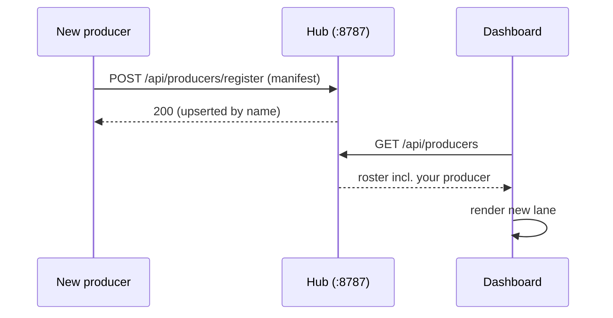

# Extending & Contributing

The pipeline is built to be extended by adding new agents, not by editing existing ones. If you want the system to do something it doesn't do today — write a different kind of proposal, chase a new content format, watch a new platform — the answer is almost always "spin up a new producer," not "modify the hub."

This page covers how to add a producer, the rules that keep every agent decoupled, and where the project is headed next.

!!! note "Prerequisite reading"
    This page assumes you've read [Architecture](architecture.md) and the [API Reference](api-reference.md). The producer contract described below is a restatement of the same integration surface — nothing here introduces new routes or fields.

## Adding a new producer

Every producer in the system — including the one shipping today, SimilarContent — was built from the same scaffold: `_producer-template/`. It is not a toy example; it's the literal starting point.

```bash
cp -r _producer-template MyNewProducer
cd MyNewProducer
```

### 1. Fill in `agent.json`

This is the producer's manifest — the same shape every producer sends to `POST /api/producers/register` on startup:

```json
{
  "name": "my-new-producer",
  "kind": "proposal",
  "consumes": ["corpus", "analysis", "audio"],
  "human_gate": true,
  "needs_reference": false,
  "produces": "studio_markdown",
  "output_status": "proposed",
  "config_schema": {},
  "secrets": [
    { "name": "GEMINI_API_KEY", "env_var": "GEMINI_API_KEY", "required": true }
  ],
  "workflow_stages": ["Queued", "Generating", "Self-eval", "Proposed", "Approved", "Rejected"]
}
```

| Field | What it controls |
|---|---|
| `name` | Stable identifier used everywhere downstream — studio filenames, eval records, board queries. Pick it once and don't rename it. |
| `kind` | One of `clone`, `proposal`, `idea`, `template` (or `analyzer`/`discovery` for non-producer agents). Drives which corpus fields the Dashboard highlights. |
| `consumes` | Declarative list of hub resources this producer reads — documentation for the Dashboard and for other contributors, not an enforced permission. |
| `human_gate` | Whether proposals from this producer must be approved in the Dashboard before being treated as final. |
| `needs_reference` | Set `true` only if the producer ingests an external reference video via `POST /api/reference/{platform}` (today, only the template-content pattern needs this). |
| `secrets` | Declared by **environment variable name only** — never a value. The hub can report presence/absence via `GET /api/config/agent/{name}/secrets/status`, but it never stores or sees the secret itself. |
| `workflow_stages` | The ordered lane labels the Dashboard renders for this producer's board (`GET /api/agents/{name}/board`). Keep `Approved`/`Rejected` as the terminal lanes if `human_gate` is true — the hub derives them from the gate log, your agent never emits them. |

### 2. Fill in `CLAUDE.md`

This is where the producer's actual judgment lives: what makes a good output for this producer's `kind`, how to pick targets from the corpus, what the self-eval rubric checks before publishing. The template ships a skeleton with the sections every existing producer uses — persona, method, self-eval criteria — so you're filling in judgment, not scaffolding.

### 3. Open a session and register

Run the producer's `cli.py` (or equivalent entry point) once. On boot it should:

1. Call `GET /api/platforms` to confirm the hub is reachable.
2. Call `POST /api/producers/register` with the manifest — idempotent, safe to call on every startup.
3. Call `GET /api/config/agent/{name}` to pick up any Dashboard-configured overrides.

That's the entire "installation" step.

!!! tip "Self-registration is the point"
    There is no producer allow-list to edit, no frontend code to touch, no hub restart required. The moment a producer calls `POST /api/producers/register`, `GET /api/producers` includes it and the Dashboard renders a new lane. Pluggability is a runtime property of the registry, not a build-time one.

### 4. Confirm it appears

Open the Dashboard and check the producer lanes. A newly registered producer shows up with an empty board until it runs its first item — that's expected. If it doesn't show up at all, the registration call didn't reach the hub; check `BACKEND_API` and the hub's own logs.



## How agents stay decoupled

The whole system works because every agent — hub included — agrees to one rule: **the only integration point is HTTP, through the hub's `/api/*` surface.** No agent reads another agent's files, imports another agent's code, or assumes another agent's folder layout.

This is a design decision, not an accident of the current file tree. See [Concepts → Producer SPI contract](concepts.md#producer-spi-contract) for the full rationale, but the practical consequences for a contributor are:

- **Talk to `BACKEND_API`, never a path.** Every agent reads the hub's address from an env var (default `http://127.0.0.1:8787`), never a hardcoded filesystem path or relative import. This is what lets the hub live anywhere and every sibling agent stay a plain, independent project.
- **Own your memory.** Each agent keeps its own local memory (`memory/MEMORY.md`, `patterns.md`, `persona.md` in the template) for its own working context. The *only* cross-agent channel is the hub's shared insight exchange (`GET`/`POST /api/insights`) — a deliberately narrow, append-only feed of transferable one-line learnings, not a shared database.
- **`content_id` and `audio_id` are the join keys, not folder conventions.** A producer correlates a blueprint, a piece of content, and a sound entirely through these two IDs returned by the hub's API — never by guessing at another agent's file naming.
- **Secrets are local, referenced by name.** Your producer's `.env` holds its own API keys. The manifest declares only the env-var *name*; the hub can tell the Dashboard whether a secret is present, never what it is.

!!! warning "What decoupling is not"
    Decoupling doesn't come from directory layout — sibling folders under `pi/` are a convenience, not an architectural boundary. A producer that reaches across into `../ReelScraper/analysis/` on disk instead of calling `GET /api/analysis/{platform}` has broken the contract even though the file happens to be reachable.

## Safety rules for contributors

A few rules are non-negotiable regardless of what your producer does:

- **Producers never scrape.** Only ReelScraper and AutoSearch are permitted to talk to a platform (Instagram/X/YouTube) directly, and both do so read-only, paced, and behind a kill-switch. If your producer needs more source material, it reads the corpus, analysis, and reference queue through the hub — it does not open its own scraping session.
- **Reference ingestion is the one sanctioned exception**, and only for producers with `needs_reference: true`. `POST /api/reference/{platform}` downloads via yt-dlp or a direct GET — never login or cookies — and marks the result as non-corpus content (not scored, not treated as a real reel).
- **Respect the human gate.** If your manifest declares `human_gate: true`, your producer must stop at `status:"proposed"` and let a human decide via the Dashboard. Never emit `approved`/`rejected` yourself — those states are derived only from a human's `POST /api/studio/{platform}/{file}/status` (or the discovery equivalent) call.
- **Log lifecycle events, not chatter.** Use `POST /api/logs` for curated `item.start` / `item.stage` / `item.done` / `item.error` events so your producer's board renders correctly — this is what makes the Dashboard's per-agent lanes work at all.
- **Don't invent new routes.** If your producer needs a capability the current `/api/*` surface doesn't offer, that's a hub change to propose and discuss — not something to work around with a side channel.

## Roadmap

The pipeline today runs one producer (SimilarContent) end-to-end. The architecture was built for several more, and for a tighter feedback loop between what gets published and what the system learns from it.

### Three future producers

All three are meant to be spun up from `_producer-template/` exactly as described above — no hub changes required to add them.

| Producer | `kind` | What it adds |
|---|---|---|
| **proposal-content** | `proposal` | Generates several original script proposals grounded in the corpus's proven winning factors, rather than cloning one clip 1:1. `human_gate: true` — a human picks which proposal(s) move forward. |
| **creative-idea** | `idea` | Cross-references virality factors, formulas, and trending audio to surface net-new concepts that don't map to any single existing clip — the most exploratory of the three. |
| **template-content** | `template` | The only producer with `needs_reference: true`: takes a reference video's structure (ingested via `POST /api/reference/{platform}`) and re-applies it to the operator's own topic. |

### The outcome/measure eval loop

Today's self-eval loop (a producer's own judge scoring its own output before proposing it) closes half of the feedback cycle. The other half — did the approved content actually perform once posted? — is the planned next step: feeding real post-publication outcomes back through `POST /api/evals` so producers can measure against ground truth, not just an internal rubric. This turns the eval history the Dashboard already charts into a genuine improvement signal rather than a self-consistency check.

### A dedicated trending-audio scraper

The current trending-sound table (`GET /api/audio/{platform}/trending`) is explicitly an approximation: it measures adoption velocity *within the creators the pipeline already tracks*, not the platform's true trending chart. A dedicated scraper for platform-wide trending audio is on the roadmap to close that gap — it would slot in as another data source feeding `audio_id`-keyed records the same way scraped content does today, without changing how producers consume `/api/audio/*`.

### Multi-platform

`instagram`, `x`, and `youtube` are already first-class in the schema (`GET /api/platforms`, every route parameterized by `{platform}`), but not every platform has equal coverage across scraping, analysis, and audio. Expanding depth of coverage on the existing three, and eventually onboarding further platforms, is ongoing work — the per-platform adapter pattern in `platforms/<p>/` is designed to make this additive rather than invasive.

!!! note "None of this requires touching the hub"
    Every item above is either a new agent (built from the template) or a data-quality improvement behind an existing route. That's intentional: the roadmap is a roadmap for *agents*, not for hub surface area.

## Project layout

A quick map for orienting yourself across the repos:

```
pi/
├── ReelScraper/            the hub — REST API, scraping, scoring, serves the Dashboard build
│   ├── core/               shared scoring/memory/corpus engine
│   ├── platforms/<p>/      per-platform scrape/normalize/config
│   ├── api/app.py          the FastAPI hub itself
│   ├── media/<p>/          downloaded clip video + thumbnails
│   ├── analysis/<p>/       saved blueprints (schema_version 2)
│   ├── studio/<p>/         producer proposals + human-gate log
│   ├── discovery/<p>/      AutoSearch candidates + gate log
│   ├── producers/          self-registered producer manifests
│   └── frontend/dist/      the built Dashboard, served at "/"
├── AnalysisEngine/         watches clips with Gemini, writes blueprints
├── SimilarContent/         producer: clones a winning clip from its blueprint
├── AutoSearch/             discovery agent: finds new creators via IG search
├── Dashboard/              React control board (source; builds into ReelScraper/frontend/dist)
├── demo-data/              empty here; ./demo unpacks demodataset.zip (shipped separately) into it
└── _producer-template/     the scaffold — start here for a new producer
```

Every directory under `pi/` other than `ReelScraper/` is an independent, uv-managed project that talks to the hub purely over HTTP. See [Architecture](architecture.md) for how the pieces fit together and the [Pipeline](architecture.md) page for how a piece of content moves through all eight stages.
