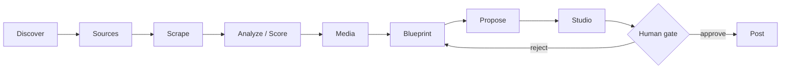

# The Cutting Room

**The Cutting Room** is a local-first, $0-to-run, offline-capable pipeline that mines viral short-form video, figures out *why* it works, and produces new content grounded in that analysis. It watches handpicked creators, scores what they post, breaks the winners down frame-by-frame into generation-ready blueprints, and hands those blueprints to producer agents that draft new material — all gated by a human before anything goes out.

Everything runs on your machine. There is no cloud service, no hosted database, and no per-seat pricing — just a FastAPI hub, a set of independent agents, and a browser dashboard talking to `http://127.0.0.1:8787`.

!!! note "Who this is for"
    You're comfortable running local Python/Node tooling and want a repeatable system for turning "what's working right now" into drafted content — not a hosted SaaS product.

## The one principle

Every agent in the system integrates with every other agent through exactly one door: the hub's HTTP API.

> **Agents never read another agent's files. They only call `/api/*` on the hub.**

There's no shared filesystem contract, no message queue, no direct process-to-process call between agents. `AnalysisEngine` doesn't know where `SimilarContent`'s code lives, and `SimilarContent` doesn't know where the scraped media sits on disk. Each agent only knows a `BACKEND_API` URL (default `http://127.0.0.1:8787`) and a slice of the REST contract it needs. Decoupling comes entirely from that HTTP boundary — not from folder layout, not from a shared library.

This has two practical consequences worth internalizing before you touch anything:

- **You can add a new producer without touching existing agents.** Copy `_producer-template/`, register it via `POST /api/producers/register`, and it shows up in the Dashboard automatically — see [Producer SPI](agents-producers.md).
- **`content_id` is the join key that makes this work.** It ties a scraped post, its downloaded media, and its blueprint together across every agent that touches it, without any agent needing to know how another agent stores things. See [Data Model](architecture.md).

!!! tip "Secrets stay local"
    Each agent keeps its own API keys in its own `.env`. The hub only ever sees the *name* of an env var (e.g. `GEMINI_API_KEY`) via `GET /api/config/agent/{agent}/secrets/status`, never the value.

## The agent roster

| Agent | Role | Kind |
|---|---|---|
| **ReelScraper** | The hub itself (`:8787`). Scrapes creator pages, scores virality, serves the entire `/api/*` contract, and hosts the built Dashboard + local media files. | hub |
| **AnalysisEngine** | Watches top clips frame-by-frame with Gemini and writes generation-ready blueprints (`schema_version` 2) that every producer reads. | analyzer |
| **SimilarContent** | Recreates a winning clip 1:1 from its blueprint's shots and regeneration guide. | producer (`clone`) |
| **Dashboard** | The "Cutting Room" control board — React/TS/Vite, reads and controls everything over HTTP only. | frontend |
| **AutoSearch** | The front door. Searches Instagram for new creators worth scraping and proposes them for human approval. | discovery |
| **`_producer-template/`** | Scaffold for spinning up new producers (proposal, idea, template-content agents) without re-deriving the hub contract. | template |

Full responsibilities and boundaries for each are in [Architecture](architecture.md); the exact endpoints each one calls are in [Agent Call Flows](architecture.md).

## The pipeline, end to end

Content flows through eight stages, starting with discovering *who* to watch and ending with a human-approved draft ready to post:



| Stage | Owner | What it produces |
|---|---|---|
| **Discover** | AutoSearch | Creator candidates, posted to `POST /api/discovery/{platform}` for human review |
| **Sources** | `pages.txt` (human-curated or auto-search-approved) | The handle list a scrape run consumes |
| **Scrape** | ReelScraper | Raw per-post JSON — metrics, captions, media URLs |
| **Analyze / Score** | ReelScraper's 4-signal virality engine | Percentile-normalized `virality_score` (0–100) + tier per post |
| **Media** | ReelScraper | Downloaded video + thumbnail for tier-gated top clips (per `virality.media_filter`), `media/<platform>/<content_id>.mp4` |
| **Blueprint** | AnalysisEngine | Schema-2 blueprint via `POST /api/analysis/{platform}` — shots, characters, text overlays, regeneration guide |
| **Propose** | The producer declaring `proposes: true` (SimilarContent today) | Ranks winners by how cheap they are to remake, joins each to its blueprint, and writes a recipe. Free, and the last stage the cascade can fire unattended |
| **Studio** | `POST /api/studio/{platform}` + the human gate | Markdown proposals, approved or rejected by a person before anything is posted or rendered |

This loop is designed to close: what gets approved and posted feeds back into what you watch and score next, so the system keeps learning what's currently working. See [Pipeline](architecture.md) for the full stage-by-stage breakdown, including how AutoSearch's candidate-approval loop feeds `pages.txt`.

## Quickstart, in one line

```bash
./demo
```

With `demodataset.zip` (shipped separately) in the repo root, that unpacks the sample dataset, launches the hub, and opens a **fully populated** dashboard — a scored corpus, blueprints, clone recipes at the human gate, and rendered reels that play. No API keys, no scraping, no model calls. Without the zip it prints how to get it, or run `./init` for a clean start.

Starting for real instead:

```bash
./init      # clean setup + launch, empty studio, ready for your own handles
./docsite      # build and serve this documentation site
```

Each script checks its own prerequisites and installs what is missing, so none of them assume a previous step. They prefer port 8787 (8000 for the docs) and fall back to a free one when it is busy, printing the port they actually got.

From there, running the other agents (AnalysisEngine, SimilarContent, AutoSearch) is a matter of starting their own `cli.py` against the same hub. See [Entry Points & Demo Data](entry-points.md) for the full picture, and [Quickstart](quickstart.md) for the first-run walkthrough.

!!! warning "Order matters on a cold start"
    A blueprint needs downloaded media; a producer needs a blueprint. If the Studio lane looks empty, check that Scrape → Analyze → Media → Blueprint have each run at least once for the platform you're working with.

## Where to go next

- [Quickstart](quickstart.md) — install, boot the hub, run your first pipeline pass.
- [Architecture](architecture.md) — every agent's responsibilities and boundaries in depth.
- [Pipeline](architecture.md) — the eight stages, stage by stage, with what each one reads and writes.
- [API Reference](api-reference.md) — the complete `/api/*` surface.
- [Data Model](architecture.md) — `content_id`, `audio_id`, `candidate_id`, `run_id`, and the on-disk layout they tie together.
- [Producer SPI](agents-producers.md) — how to build and register a new producer agent.
- [Agent Call Flows](architecture.md) — the exact hub calls each agent makes, in sequence.
