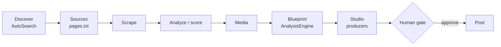

# Quickstart & Usage

This page gets the pipeline running end-to-end on your machine: install the hub, launch the Dashboard, run every pipeline stage once, and get oriented in the control board. For the full HTTP surface see the [CLI Reference](cli.md); for how the pieces fit together see [Architecture](architecture.md).

## Prerequisites

| Requirement | Why | Notes |
|---|---|---|
| **uv** | Dependency/env management for every Python agent | Installs `.venv` from `pyproject.toml` + `uv.lock`; every command is prefixed `uv run` |
| **Python ≥ 3.10** | Runtime for the hub and all agents | Managed transparently by uv |
| **Node.js** | Builds the Dashboard frontend | Only needed if you're building the Dashboard from source rather than using a prebuilt `frontend/dist` |
| **Gemini API key** | Required by AnalysisEngine | Frame-by-frame video analysis that writes blueprints; without it the Blueprint stage exits with an error |
| **Anthropic API key** *(optional)* | Powers AutoSearch's niche-fit relevance judgment and search-term expansion | Falls back to seed keywords verbatim if absent |
| **Burner Instagram session** *(optional)* | Lets AutoSearch do authenticated topic search | AutoSearch and ReelScraper are guest-first by default; the burner is opt-in and paced strictly slower than the scraper |

!!! note "Secrets stay local"
    Every agent references its secrets by **environment variable name only**. The hub never stores secret values — `GET /api/config/agent/{agent}/secrets/status` only reports presence (`true`/`false`), never the value itself. Set keys in each agent's own `.env` (copy from `.env.example` in `_producer-template/` when scaffolding a new one).

## Install

The hub — ReelScraper — is the only component you must install to get a working pipeline; sibling agents (AnalysisEngine, SimilarContent, AutoSearch, Dashboard) are independent uv-managed projects that integrate purely over HTTP via `BACKEND_API`.

```bash
cd ReelScraper
uv sync
```

This creates `.venv` and installs dependencies (stdlib `sqlite3`, `openpyxl`, `fastapi`, `uvicorn`, and friends).

If you're running producers or AnalysisEngine too, repeat `uv sync` inside each sibling directory, and set their required environment variables:

```bash
# AnalysisEngine
cd ../AnalysisEngine
uv sync
export GEMINI_API_KEY="..."

# AutoSearch (optional)
cd ../AutoSearch
uv sync
export ANTHROPIC_API_KEY="..."   # optional — enables term expansion + relevance judgment
```

!!! tip "BACKEND_API"
    Every agent defaults to `http://127.0.0.1:8787` for `BACKEND_API`. You normally don't need to set it unless you're running the hub on a different host or port.

## Launch the hub

From inside `ReelScraper/`, the single entry point is `cli.py`:

```bash
uv run cli.py start
```

This boots the FastAPI hub and opens the Dashboard at **http://127.0.0.1:8787**. In production the hub serves the Dashboard's built frontend (`frontend/dist`) as static files at `/`, same-origin — there is no separate frontend server to run. If `frontend/dist` hasn't been built yet, the hub falls back to a plain "hub is running, frontend not built" page instead.

!!! note "Interactive API contract"
    Every request body in the hub is a typed Pydantic model, so `http://127.0.0.1:8787/docs` gives you a live, browsable OpenAPI contract for the whole `/api/*` surface — useful while you're getting oriented.

## Run the pipeline end-to-end

The pipeline is seven stages. Discover and Sources feed the handle list; Scrape through Studio turn that list into gated, publishable content.



Stages 3–6 are launched as background jobs through the hub's generic pipeline dispatcher, either from the Dashboard's **Producers** view or directly via `curl`. Each call returns a `job_id` you can poll.

### 1. Seed a source list

Add creator handles to `platforms/<platform>/pages.txt` by hand, or approve AutoSearch candidates in the Dashboard's **Discover** tab (approving appends the handle automatically — see the [CLI Reference](cli.md) for the discovery routes).

### 2. Scrape

```bash
curl -X POST http://127.0.0.1:8787/api/pipeline/instagram/scrape
```

Scrapes the handpicked creator pages listed in `pages.txt`, writing raw per-post JSON (metrics, captions, media URLs) to disk.

### 3. Analyze (score)

```bash
curl -X POST http://127.0.0.1:8787/api/pipeline/instagram/analyze
```

Runs the 4-signal virality engine (`engagement_rate`, `reach_multiplier`, `outlier_score`, `velocity`) and produces a `virality_score` (0–100) and tier per clip.

### 4. Media

```bash
curl -X POST http://127.0.0.1:8787/api/pipeline/instagram/media
```

Downloads the top-viral clips locally to `media/instagram/<content_id>.mp4` (+ thumbnail) so they can play inline in the Dashboard and be watched by AnalysisEngine.

### 5. Blueprint (AnalysisEngine)

```bash
curl -X POST http://127.0.0.1:8787/api/pipeline/instagram/analysis-engine
```

Shells out to the sibling `AnalysisEngine` project (`uv run cli.py run instagram`), which watches downloaded clips frame-by-frame with Gemini and writes schema_version-2 **blueprints** — the generation-ready substrate every producer reads — via `POST /api/analysis/instagram`.

### 6. Producer (Studio)

Producers such as SimilarContent are standalone processes you start separately (they aren't dispatched through `/api/pipeline`). Proposing is **free** — it reads blueprints and writes markdown, no API key:

```bash
cd ../SimilarContent
uv run cli.py propose --platform instagram --dry-run   # see the picks first
uv run cli.py propose --platform instagram             # publish them
```

It ranks the corpus, attaches each clip's blueprint, scores how easy each is to remake, and writes a markdown recipe to `POST /api/studio/instagram`, which lands as `proposed`.

Use `--content-id <id>` to propose one specific exemplar — ranking cannot reach a clip that sits mid-corpus, which is exactly where a freshly scraped creator lands.

### 7. Human gate

Review the proposal in the Dashboard's **Studio → Proposals** tab and approve or reject it:

```bash
curl -X POST http://127.0.0.1:8787/api/studio/instagram/<file>/status \
  -H "Content-Type: application/json" \
  -d '{"status": "approved"}'
```

Approving does not spend anything. Approved items move to the **Renders** tab, where they wait to be rendered.

### 8. Render (this one costs money)

```bash
uv run cli.py render --platform instagram --file <file>.md --dry-run   # free: prints every prompt
uv run cli.py render --platform instagram --file <file>.md
```

Generates one image per shot (Nano Banana, ~$0.04 a frame), stitches them with ffmpeg into a **silent** 1080×1920 reel whose duration matches the source clip, writes a caption with Gemini, and uploads the result to `POST /api/renders/instagram`.

The reel then appears in **Studio → Renders** with its sound sheet, the caption, and the on-disk path. Instagram has no post API here, so attaching the sound and uploading is deliberately manual.

`--restitch` re-encodes the frames already on disk — free, and useful after changing the aspect ratio or fit.

!!! tip "Watch it happen live"
    Open the Dashboard's **Activity** tab while stages run — it streams the same `/api/events` SSE channel the CLI jobs write to, so you'll see per-item lifecycle events (`item.start` → `item.stage` → `item.done`) as they happen instead of polling.

## Dashboard tour

The Dashboard ("The Cutting Room") is a React 18 + TypeScript + Vite control board. It reads and controls everything over HTTP only — there is no separate state store to keep in sync.

| Tab | What it shows |
|---|---|
| **Board** | The 7-stage pipeline as a live board; per-agent workflow lanes reduced from the central log (`GET /api/agents/{name}/board`) |
| **Corpus** | Scraped + scored content: virality factors, top-N clips, narrative briefs, and full-text search over the corpus |
| **Sounds** | Trending-audio table — adoption velocity within tracked creators, bucketed Rising/Hot/Saturated/Evergreen |
| **Studio** | Producer proposals awaiting the human gate — approve or reject generated content before it posts |
| **Producers** | The self-registered producer roster (`GET /api/producers`) — new producers appear automatically as they register, no Dashboard code changes needed |
| **Discover** | AutoSearch candidates awaiting review; approving one appends the handle to `pages.txt` |
| **Activity** | Live log tail over SSE (`/api/events`, `log` channel) — the lifecycle event stream every agent posts to |
| **Evals** | Self-eval and judge scores over time, feeding score-trend charts per agent/target type |
| **Config** | Per-platform `niche_config.json` + `pages.txt`, and per-agent config/secrets-presence, both schema-driven from each producer's registered manifest |

!!! note "Everything is derived from the log"
    The Board, Activity, and per-agent lanes are all reductions of the same append-only `logs/agents.jsonl` stream (plus a gate-log left-join for Approved/Rejected). There's no separate "status" database to fall out of sync with reality.

## Next steps

- Browse the full HTTP contract — every route, request/response model, and stage name — in the [CLI Reference](cli.md).
- Understand how the hub, Dashboard, and each agent fit together, and why the HTTP boundary is the only integration point, in [Architecture](architecture.md).
